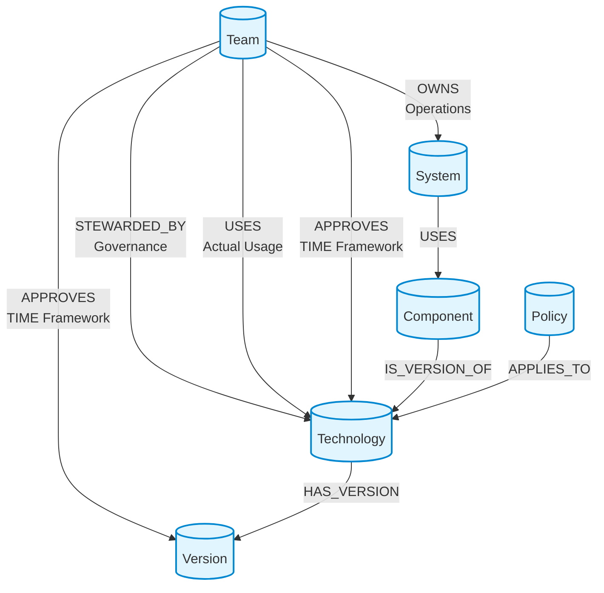
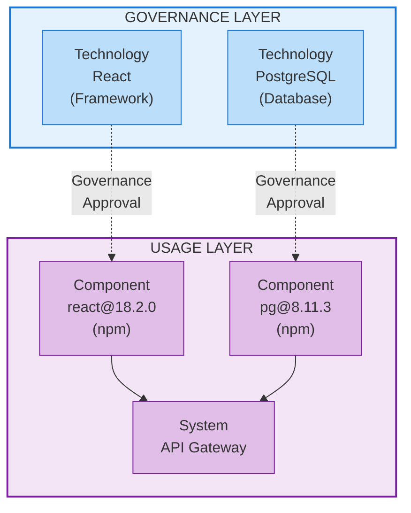

## Overview

Polaris uses a **graph database** to model your enterprise technology landscape. Unlike traditional databases that store data in tables, a graph database stores information as **nodes** (entities) and **relationships** (connections between entities).

### Why a Graph Database?

The graph structure is ideal for technology catalogs because:

1. **Natural Relationship Modeling** - Technology ecosystems are inherently interconnected. A graph naturally represents how teams own systems, systems use components, and components implement technologies.

2. **Flexible Queries** - You can easily answer questions like "Which teams are using deprecated technologies?" or "What systems will be affected if we retire this technology?" without complex joins.

3. **Evolving Schema** - As your technology landscape grows, you can add new relationship types without restructuring existing data.

4. **Compliance Tracking** - The graph makes it easy to identify violations by comparing actual usage (what teams use) against approvals (what teams have approved).

## Graph Visualization



## Core Entities

The graph model consists of six main entity types:

### Technology

Represents a **governed software entity** in your enterprise catalog - a strategic choice that requires governance oversight, approval processes, and lifecycle management.

**What qualifies as a Technology?**

Technologies are foundational software choices that:
- Require architectural approval and governance
- Have long-term strategic impact on the organization
- Need version management and security oversight
- Are subject to enterprise policies and standards

**Technology Categories:**

1. **Foundational Runtime or Framework** - Core execution environments and application frameworks
   - Examples: Node.js, React, Vue, Angular, Spring Boot
   - Impact: Defines application architecture and development patterns

2. **Data Platform** - Database systems and data storage technologies
   - Examples: PostgreSQL, MongoDB, Neo4j, Redis, Elasticsearch
   - Impact: Determines data architecture and persistence strategies

3. **Integration Platform** - Middleware and integration technologies
   - Examples: Kafka, RabbitMQ, API Gateway, GraphQL
   - Impact: Defines system integration patterns and data flow

4. **Security or Identity Tech** - Authentication, authorization, and security tools
   - Examples: OAuth2, Keycloak, Vault, LDAP
   - Impact: Determines security architecture and compliance

5. **Infrastructure / Container Tech** - Deployment and infrastructure technologies
   - Examples: Docker, Kubernetes, Terraform, AWS services
   - Impact: Defines deployment architecture and operational model

6. **Explicitly Disallowed or Deprecated** - Technologies that are banned or being phased out
   - Examples: jQuery (deprecated), Flash (disallowed), outdated frameworks
   - Impact: Prevents technical debt and security risks

**Key Information Tracked:**
- Basic details (name, description, category)
- Vendor/maintainer information
- Approved version ranges (using semantic versioning)
- External resources (homepage, documentation, repository)
- License information
- Risk assessment and review dates

**Important Note:** Technologies don't have a single "status" field. Instead, each team approves technologies with a TIME category (invest, migrate, tolerate, eliminate) via the APPROVES relationship. This allows different teams to have different policies for the same technology.

### Version

Represents a specific version of a technology with approval status and security information.

**What it tracks:**
- Version number (e.g., "18.2.0")
- Release and end-of-life dates
- Approval status
- Security vulnerability scores (CVSS)
- Additional notes and context

**Why it matters:** Version tracking enables you to identify systems using outdated or unsupported versions, helping you plan upgrades and maintain security. Teams can approve specific versions with different TIME categories.

### Component

Represents **software entities actually used in systems** - the concrete dependencies and packages discovered through SBOM (Software Bill of Materials) scanning.

**What is a Component?**

Components are concrete software artifacts that:
- Are discovered through SBOM scanning and dependency analysis
- Represent actual usage in one or more systems
- May or may not map to a governed Technology
- Include transitive dependencies and third-party libraries

**Component vs Technology:**

| Aspect | Technology | Component |
|--------|-----------|-----------|
| **Definition** | Governed strategic choice | Actual software artifact in use |
| **Governance** | Requires approval and oversight | Tracked for compliance |
| **Scope** | Enterprise-wide decision | System-specific dependency |
| **Examples** | "React" (framework choice) | "react@18.2.0" (npm package) |
| **Lifecycle** | Managed through policies | Discovered through scanning |

A Component may be an instance of a Technology (e.g., `react@18.2.0` is a component that implements the `React` technology), or it may be a transitive dependency that doesn't require governance approval.

**Key Information Tracked:**
- Package name and version
- Package manager (npm, pip, maven, etc.)
- License type
- Source repository URL
- Import path in code
- Package integrity hash

### System

Represents a deployable unit, service, or application in your organization.

**What it tracks:**
- System identity (name, description)
- Business domain
- Owning team
- Business criticality level (low, medium, high, critical)
- Deployment environment (dev, staging, production)
- Source code location

**Why it matters:** Systems are the high-level containers for your applications. They help organize components and show the bigger picture of your technology landscape. Understanding which team owns which systems enables accountability and proper governance.

### Team

Represents an organizational team with ownership and governance responsibilities.

**What it tracks:**
- Team identity (name, description)
- Contact information (email, Slack channel)
- Area of responsibility (frontend, backend, data, infrastructure, security)

**Why it matters:** Teams are the organizational unit for ownership and approvals. The graph model supports three distinct team responsibilities:
- **Stewardship** - Technical governance of technologies
- **Ownership** - Operational responsibility for systems
- **Approval** - Usage decisions for technologies

### Policy

Represents a governance rule for technology usage.

**What it tracks:**
- Policy details (name, description, type)
- Severity level (info, warning, error, critical)
- Effective date range
- Enforcing team
- Scope (organization, domain, team)
- Status (active, draft, archived)

**Why it matters:** Policies define your governance rules. They can require approval before using certain technologies, mark technologies as deprecated, enforce security standards, or implement other organizational requirements.

## Relationships

The power of the graph model lies in its relationships. Here are the key connections:

### Understanding STEWARDED_BY vs OWNS vs USES vs APPROVES

These four relationship types represent different aspects of team responsibility:

**STEWARDED_BY (Team → Technology)**
- **Purpose:** Technical stewardship and governance responsibility
- **Cardinality:** One team stewards each technology
- **Responsibilities:**
  - Maintaining technology standards
  - Evaluating new versions
  - Setting version ranges
  - Risk assessment
  - Documentation and best practices
- **Note:** This is governance responsibility, not operational ownership

**OWNS (Team → System)**
- **Purpose:** Operational ownership and responsibility
- **Cardinality:** One team owns each system
- **Responsibilities:**
  - Running and maintaining the system
  - System lifecycle management
  - Operational support
  - Deployment and updates
- **Note:** This is operational responsibility, not governance

**USES (Team → Technology)**
- **Purpose:** Tracks actual technology usage by teams
- **Cardinality:** Many-to-many (multiple teams can use the same technology)
- **How it works:** Automatically inferred from system ownership and component dependencies
  - Team → System → Component → Technology
- **Properties tracked:**
  - When the team first started using this technology
  - When the usage was last verified
  - Number of systems using this technology
- **Why it matters:** Enables compliance checking by comparing actual usage against approvals

**APPROVES (Team → Technology or Version)**
- **Purpose:** Usage approval with TIME framework categorization
- **Cardinality:** Many-to-many (multiple teams can approve the same technology)
- **How it works:** Each team independently decides whether to use a technology
- **Properties tracked:**
  - TIME category (invest, migrate, tolerate, eliminate)
  - Approval timestamp and approver
  - Deprecation date and end-of-life date
  - Migration target (for technologies being phased out)
  - Version constraints
  - Additional notes
- **Why it matters:** Enables decentralized decision-making while maintaining governance

**Example Scenario:**
- TypeScript is **STEWARDED BY** Frontend Platform (technical governance)
- Customer Portal system is **OWNED BY** Frontend Platform (operational responsibility)
- TypeScript is **USED** by Frontend Platform (3 systems) AND Backend Platform (5 systems)
- TypeScript is **APPROVED** by Frontend Platform (time: invest) AND Backend Platform (time: invest)

### Other Key Relationships

**HAS_VERSION (Technology → Version)**
- Links technologies to their specific versions
- Enables version-specific approvals and policies

**IS_VERSION_OF (Component → Technology)**
- Links components that implement governed technologies
- **Optional relationship** - not all components map to technologies
- When present: Component is subject to technology approval policies
- When absent: Component is a transitive dependency or utility library tracked for security/licensing but not governance

**USES (System → Component)**
- Links systems to the components they depend on
- Discovered through SBOM scanning
- Foundation for understanding technology usage

**APPLIES_TO (Policy → Technology)**
- Links policies to the technologies they govern
- Enables technology-specific governance rules

## Governance Models

### Stewardship vs Ownership vs Approval

Polaris uses a **centralized stewardship, decentralized approval** model with clear separation between technical governance and operational ownership:

#### Stewardship (Centralized Technical Governance)

**One team stewards each technology** and is responsible for:
- Setting approved version ranges
- Evaluating security vulnerabilities
- Maintaining documentation and best practices
- Assessing risk levels
- Reviewing and updating technology standards

**Example:**
- Frontend Platform **stewards** TypeScript
- Frontend Platform sets approved version range: ">=5.0.0 <6.0.0"
- Frontend Platform maintains TypeScript coding standards

#### Ownership (Operational Responsibility)

**One team owns each system** and is responsible for:
- Running and maintaining the system
- System lifecycle management
- Operational support and monitoring
- Deployment and updates

**Example:**
- Frontend Platform **owns** Customer Portal system
- Backend Platform **owns** API Gateway system

#### Approval (Decentralized Usage)

**Multiple teams can approve the same technology** for their use:
- Each team independently decides whether to use the technology
- Teams can have different TIME categories for the same technology
- Teams can set additional version constraints
- Teams can have different migration timelines

**Example:**
- Frontend Platform **approves** TypeScript (time: invest, notes: "Required for all new frontend projects")
- Backend Platform **approves** TypeScript (time: invest, notes: "Required for all backend services")
- Data Platform might **not approve** TypeScript (no APPROVES relationship = eliminate)

### Real-World Scenario: Java

**Stewardship:**
- Backend Platform **stewards** Java
- Sets approved version range: ">=17 <22"
- Maintains Java coding standards
- Evaluates security patches

**Approvals:**
- Backend Platform **approves** Java (time: invest, versionConstraint: ">=17")
- Data Platform **approves** Java (time: tolerate, versionConstraint: ">=11", notes: "Legacy batch jobs only")
- Frontend Platform **does not approve** Java (no relationship = eliminate, use TypeScript instead)

## Technology vs Component: Understanding the Distinction

### Conceptual Model



### Key Differences

**Technology (Governance Layer):**
- Strategic architectural decision
- Requires approval and policy compliance
- Managed through TIME framework (invest, migrate, tolerate, eliminate)
- Subject to version constraints and security reviews
- Example: "We approve React as our frontend framework"

**Component (Usage Layer):**
- Concrete implementation discovered in systems
- Actual package/dependency in use
- Tracked through SBOM scanning
- May include transitive dependencies
- Example: "System X uses react@18.2.0 from npm"

### Relationship Flow

1. **Governance Decision**: Team approves a Technology (e.g., React)
2. **Implementation**: Developers use Components that implement that Technology (e.g., react@18.2.0)
3. **Discovery**: SBOM scanning discovers Components in Systems
4. **Compliance Check**: Components are validated against approved Technologies
5. **Violation Detection**: Components without corresponding Technology approval are flagged

### Example Scenarios

**Scenario 1: Compliant Usage**
```
Technology: React (approved by Frontend Platform)
Component: react@18.2.0 (used in Customer Portal)
Status: ✅ Compliant - Component version within approved range
```

**Scenario 2: Version Violation**
```
Technology: React (approved range: >=18.0.0 <19.0.0)
Component: react@17.0.2 (used in Legacy App)
Status: ⚠️ Warning - Component version outside approved range
```

**Scenario 3: Unapproved Technology**
```
Technology: jQuery (deprecated, not approved)
Component: jquery@3.6.0 (used in Admin Dashboard)
Status: ❌ Violation - Using deprecated technology without approval
```

**Scenario 4: Transitive Dependency**
```
Technology: N/A (not a governed technology)
Component: lodash@4.17.21 (transitive dependency)
Status: ℹ️ Tracked - Not subject to governance, but monitored for security
```

## Policy Governance Model

### Policy Enforcement Architecture

Polaris implements a **team-based policy enforcement model** that enables sophisticated governance rules:

#### Policy Lifecycle

**Effective Dates:**
- Policies have `effectiveDate` (when they become active)
- Policies can have `expiryDate` (when they expire, or null for no expiry)
- Policies have `status` (active, draft, archived)

**Enforcement:**
- Each policy specifies which team is responsible for enforcement
- Policies have a `scope` (organization, domain, team)
- Policies have a `severity` level (info, warning, error, critical)

#### Policy Scopes

**Organization Scope:**
- Applies to all teams in the organization
- Example: "All teams must use approved technologies"

**Domain Scope:**
- Applies to teams in a specific domain (frontend, backend, data, etc.)
- Example: "Frontend teams must use TypeScript"

**Team Scope:**
- Applies to a specific team
- Example: "Frontend Platform must review all new framework proposals"

### Example: Security Policy

**Policy:** High Risk Technology Review

**Configuration:**
- Effective date: 2025-01-01
- Enforced by: Security team
- Scope: Organization-wide
- Status: Active
- Severity: Error

**How it works:**
1. Security team enforces the policy
2. All teams are subject to the policy
3. Policy governs high-risk technologies
4. Violations are flagged as errors
5. Teams must get Security approval before using high-risk technologies

## TIME Framework

The TIME framework categorizes technologies based on their strategic value and lifecycle stage:

### TIME Categories

**Invest** - Technologies we're actively investing in
- Strategic importance: High
- Support level: Full support and training
- Usage: Encouraged for new projects
- Example: React, TypeScript, Kubernetes

**Tolerate** - Technologies we accept but don't promote
- Strategic importance: Medium
- Support level: Maintenance mode
- Usage: Allowed for existing projects, not recommended for new ones
- Example: Angular (if migrating to React), older Java versions

**Migrate** - Technologies we're actively moving away from
- Strategic importance: Low
- Support level: Migration support only
- Usage: Discouraged, migration plan required
- Example: jQuery, legacy frameworks

**Eliminate** - Technologies we don't allow
- Strategic importance: None
- Support level: No support
- Usage: Blocked, must be removed
- Example: Flash, severely outdated versions with security issues

### Team-Specific TIME Categories

Different teams can assign different TIME categories to the same technology based on their needs:

**Example: Angular**
- Frontend Platform: **Migrate** (moving to React)
- Legacy Systems Team: **Tolerate** (maintaining existing apps)
- Mobile Team: **Eliminate** (never used, not planning to use)

This flexibility allows teams to manage their own technology transitions while maintaining overall governance.

## Compliance and Violation Detection

### How Compliance Works

Polaris automatically detects compliance violations by comparing:
1. **What teams are using** (USES relationships from SBOM scanning)
2. **What teams have approved** (APPROVES relationships)

### Violation Types

**Unapproved Technology Usage**
- Team is using a technology they haven't approved
- Severity: High
- Action: Team must either approve the technology or remove it

**Version Constraint Violation**
- Team is using a version outside their approved range
- Severity: Medium to High
- Action: Upgrade/downgrade to approved version

**Deprecated Technology Usage**
- Team is using a technology marked as "migrate" or "eliminate"
- Severity: Medium (migrate) to Critical (eliminate)
- Action: Follow migration plan or remove immediately

**Policy Violation**
- Team is violating an active policy
- Severity: Depends on policy severity
- Action: Comply with policy requirements

### Compliance Dashboard Capabilities

The Polaris UI provides visibility into:
- Technologies used without approval
- Systems using deprecated technologies
- Version compliance status
- Policy violations by team
- Migration progress tracking
- Security vulnerability exposure

## Summary

The Polaris graph model provides:

1. **Clear Separation of Concerns**
   - Stewardship (technical governance)
   - Ownership (operational responsibility)
   - Approval (usage decisions)

2. **Flexible Governance**
   - Centralized stewardship for consistency
   - Decentralized approvals for autonomy
   - Team-specific TIME categories

3. **Automatic Compliance**
   - SBOM scanning discovers actual usage
   - Automatic comparison against approvals
   - Real-time violation detection

4. **Strategic Technology Management**
   - TIME framework for lifecycle management
   - Version-specific approvals
   - Migration planning and tracking

5. **Policy Enforcement**
   - Team-based enforcement model
   - Scoped policies (organization, domain, team)
   - Severity-based prioritization

This model enables organizations to maintain governance and compliance while giving teams the autonomy to make technology decisions appropriate for their context.
