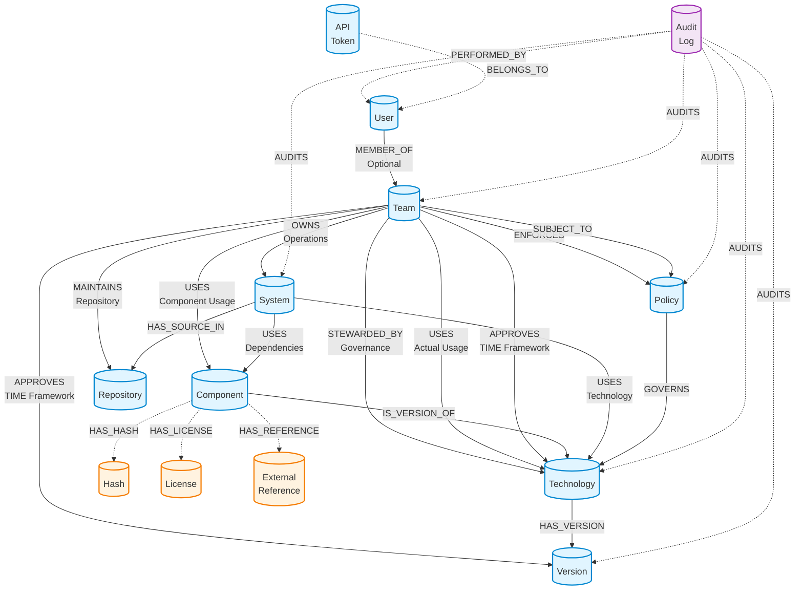
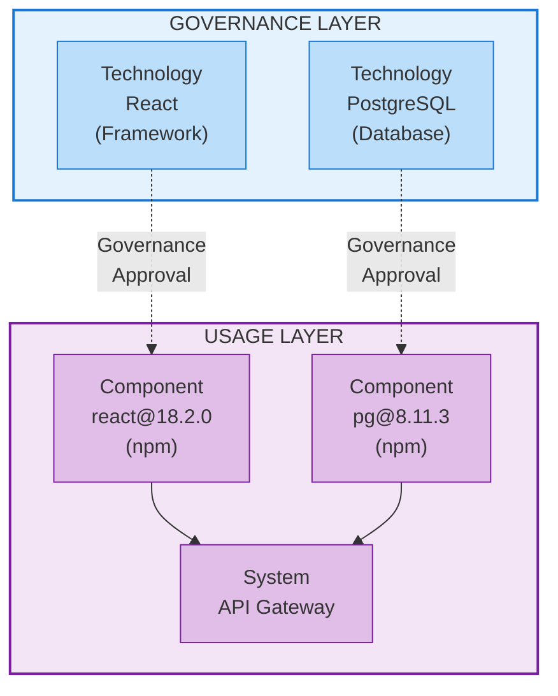

## Overview

Polaris uses a graph database to model enterprise technology landscapes. Unlike relational databases that store data in tables, graph databases store information as nodes (entities) and relationships (connections between entities).

### Why a Graph Database

**Natural Relationship Modeling**: Technology ecosystems are inherently interconnected. Graphs naturally represent how teams own systems, systems use components, and components implement technologies.

**Flexible Queries**: Complex questions like "Which teams are using deprecated technologies?" or "What systems will be affected if we retire this technology?" are answered efficiently without complex joins.

**Evolving Schema**: New relationship types can be added as the technology landscape grows without restructuring existing data.

**Compliance Tracking**: The graph enables identification of violations by comparing actual usage against approvals.

## Graph Visualization

## Core Entities

### Technology

Represents a governed software entity requiring architectural approval, lifecycle management, and governance oversight. Technologies are strategic choices with long-term organizational impact.

**Categories include:**
- Foundational runtimes and frameworks
- Data platforms
- Integration platforms
- Security and identity technologies
- Infrastructure and container technologies
- Explicitly disallowed or deprecated technologies

**Key information tracked:**
- Basic details (name, description, category)
- Vendor and maintainer information
- Approved version ranges
- External resources (homepage, documentation, repository)
- License information
- Risk assessment and review dates

Technologies don't have a single status field. Instead, each team assigns TIME categories via APPROVES relationships, enabling different policies per team.

### Version

Represents a specific version of a technology with approval status and security information. Tracks version numbers, release dates, end-of-life dates, approval status, security vulnerability scores, and additional context.

Version tracking enables identification of systems using outdated or unsupported versions for upgrade planning and security maintenance.

### Component

Represents software artifacts actually used in systems, discovered through SBOM (Software Bill of Materials) scanning. Components are concrete dependencies and packages, including transitive dependencies and third-party libraries.

**Component vs Technology:**
- **Technology**: Governed strategic choice requiring approval
- **Component**: Actual software artifact discovered in systems

Components may implement governed Technologies or be transitive dependencies tracked for security and licensing without governance requirements.

**Key information tracked:**
- Package identity (name, version, package manager, purl)
- Security data (cryptographic hashes, CPE)
- License information with SPDX identifiers
- Provenance metadata (supplier, author, publisher)
- External references (repository, documentation, issue tracker)
- Dependency context (scope, direct vs transitive)

### System

Represents a deployable unit, service, or application. Tracks system identity, business domain, owning team, business criticality level, deployment environment, and source code location.

Systems are organizational containers for applications, enabling accountability and proper governance through team ownership.

### Team

Represents an organizational team with ownership and governance responsibilities. Tracks team identity, contact information, and area of responsibility.

Teams are the organizational unit for three distinct responsibilities:
- **Stewardship**: Technical governance of technologies
- **Ownership**: Operational responsibility for systems
- **Approval**: Usage decisions for technologies

### Policy

Represents a governance rule for technology usage. Tracks policy details, severity level, effective date range, enforcing team, scope (organization, domain, team), and status.

Policies define governance rules such as requiring approval before using certain technologies, marking technologies as deprecated, or enforcing security standards.

### Repository

Represents a source code repository where systems are developed. Tracks repository URL, type, default branch, and visibility.

Repositories are the source of truth for SBOM data. When an SBOM is pushed with a repository URL, Polaris automatically updates all systems with source code in that repository.

### SBOM-Related Entities

**Hash**: Cryptographic hashes for verifying component integrity. Multiple hash algorithms provide defense-in-depth security.

**License**: Software licenses associated with components. Enables understanding legal obligations and ensuring compliance.

**External Reference**: External resources related to components (source code, documentation, issue tracker).

### Additional Entities

**ApiToken**: API authentication tokens for programmatic access to Polaris.

**Migration**: Database migration tracking for schema version management.

## Key Relationships

### Team Responsibilities

**STEWARDED_BY (Team → Technology)**
- Technical stewardship and governance responsibility
- One team stewards each technology
- Responsibilities: maintaining standards, evaluating versions, setting version ranges, risk assessment, documentation

**OWNS (Team → System)**
- Operational ownership and responsibility
- One team owns each system
- Responsibilities: running and maintaining the system, lifecycle management, operational support, deployment

**USES (Team → Technology)**
- Tracks actual technology usage by teams
- Many-to-many relationship
- Automatically inferred from system ownership and component dependencies
- Enables compliance checking by comparing actual usage against approvals

**APPROVES (Team → Technology or Version)**
- Usage approval with TIME framework categorization
- Many-to-many relationship
- Each team independently decides whether to use a technology
- Properties: TIME category, approval timestamp, approver, deprecation date, EOL date, migration target, version constraints, notes
- Enables decentralized decision-making while maintaining governance

### Other Key Relationships

**HAS_VERSION (Technology → Version)**: Links technologies to specific versions, enabling version-specific approvals and policies.

**IS_VERSION_OF (Component → Technology)**: Links components that implement governed technologies. Optional relationship—not all components map to technologies.

**USES (System → Component)**: Links systems to their dependencies, discovered through SBOM scanning.

**USES (System → Technology)**: Links systems to the technologies they use.

**GOVERNS (Policy → Technology)**: Links policies to the technologies they govern.

**ENFORCES (Team → Policy)**: Links teams to the policies they enforce.

**SUBJECT_TO (Team → Policy)**: Links teams to the policies they are subject to.

**MAINTAINS (Team → Repository)**: Links teams to the repositories they maintain.

**HAS_SOURCE_IN (System → Repository)**: Links systems to source code repositories, enabling automatic SBOM updates.

**SBOM Relationships**: HAS_HASH, HAS_LICENSE, HAS_REFERENCE connect components to their detailed metadata.

### User and Authorization Relationships

**MEMBER_OF (User → Team)**: Links users to teams they belong to. This relationship is optional—users can exist without team membership. Team membership grants authorization to manage data in the model. Includes properties for joinedAt timestamp and optional team-specific role.

### Audit Trail Relationships

**PERFORMED_BY (AuditLog → User)**: Links audit log entries to the users who performed the actions. Enables queries to find all actions performed by a specific user.

**AUDITS (AuditLog → Entity)**: Links audit log entries to the entities they track. Supports auditing of Technology, Team, Policy, System, and Version entities. Enables queries to find the complete audit history for any audited entity.

### API Token Relationships

**BELONGS_TO (ApiToken → User)**: Links API tokens to the users who own them. Enables queries to find all tokens owned by a specific user for token management and security.

## Governance Model

Polaris uses a **centralized stewardship, decentralized approval** model with clear separation between technical governance and operational ownership.

**Stewardship (Centralized)**: One team stewards each technology, responsible for setting approved version ranges, evaluating security vulnerabilities, maintaining documentation, and assessing risk levels.

**Ownership (Operational)**: One team owns each system, responsible for running and maintaining the system, lifecycle management, operational support, and deployment.

**Approval (Decentralized)**: Multiple teams can approve the same technology for their use. Each team independently decides whether to use a technology, assigns TIME categories based on their strategy, sets additional version constraints, and manages their own migration timelines.

Technologies without team approval default to **Eliminate**.

## Technology vs Component

**Technology (Governance Layer)**: Strategic architectural decision requiring approval and policy compliance. Managed through TIME framework and subject to version constraints and security reviews.

**Component (Usage Layer)**: Concrete implementation discovered in systems. Actual package or dependency tracked through SBOM scanning, including transitive dependencies.

**Relationship Flow:**
1. Governance Decision: Team approves a Technology
2. Implementation: Developers use Components that implement that Technology
3. Discovery: SBOM scanning discovers Components in Systems
4. Compliance Check: Components are validated against approved Technologies
5. Violation Detection: Components without corresponding Technology approval are flagged

## Compliance Detection

Polaris automatically detects compliance violations by comparing what teams are using (USES relationships from SBOM scanning) against what teams have approved (APPROVES relationships).

**Violation Types:**
- Unapproved technology usage
- Version constraint violations
- Deprecated technology usage (migrate or eliminate)
- Policy violations

## Universal Component Identification

Polaris uses **Package URLs (purl)** as the universal identifier for components across all package ecosystems. Purl enables universal deduplication, cross-ecosystem tracking, license compliance, and supply chain security.

Additionally, Polaris tracks **CPE identifiers** for components when available, which can be used by external vulnerability scanning tools to identify security issues.

## Audit Trail

Polaris includes a comprehensive audit trail system tracking governance decisions and data changes across the platform. This enables compliance, security auditing, and understanding how the technology catalog evolves over time.

**AuditLog Entity** tracks:
- Identity (unique ID and timestamp)
- Operation type (CREATE, UPDATE, DELETE, APPROVE, etc.)
- Entity type and ID (what was changed)
- User ID (who made the change)
- Changes (field-level before/after values)
- Context (source, IP address, session, reason)

**User Entity** represents authenticated users who interact with the system, tracking user identity, authentication provider, role, and login history.

**Audited Entities**: The audit trail focuses on governance decisions rather than operational data:
- **Technology & Version**: Approval decisions, stewardship changes, version range updates, risk level changes
- **Team**: Membership changes, responsibility area changes
- **Policy**: Creation, modification, deletion, status changes, enforcement changes
- **System**: Ownership changes, criticality level changes
- **Team Approvals**: Technology approval/revocation, TIME category changes, EOL dates, migration targets

**Not Audited**: Operational data like Components (discovered via SBOM), Repositories, Hashes, Licenses, and External References are not audited as they change frequently and have low governance value.

**Audit Relationships**:
- `PERFORMED_BY (AuditLog → User)`: Links audit entries to the user who performed the action
- `AUDITS (AuditLog → Entity)`: Links audit entries to the specific entity that was modified

## Summary

The Polaris graph model provides:

**Clear Separation of Concerns**: Stewardship (technical governance), ownership (operational responsibility), and approval (usage decisions) are distinct.

**Flexible Governance**: Centralized stewardship for consistency, decentralized approvals for autonomy, and team-specific TIME categories.

**Automatic Compliance**: SBOM scanning discovers actual usage, automatic comparison against approvals, and real-time violation detection.

**Strategic Technology Management**: TIME framework for lifecycle management, version-specific approvals, and migration planning.

**Policy Enforcement**: Team-based enforcement model with scoped policies and severity-based prioritization.

**Comprehensive SBOM Support**: Standards-compliant (SPDX, CycloneDX), universal component identification (purl, CPE), rich metadata (hashes, licenses), and automatic repository-to-system mapping.

**Complete Audit Trail**: Track all data changes with detailed context, user-level accountability, field-level change tracking, and comprehensive operation logging.

This model enables organizations to maintain governance and compliance while giving teams the autonomy to make technology decisions appropriate for their context.
