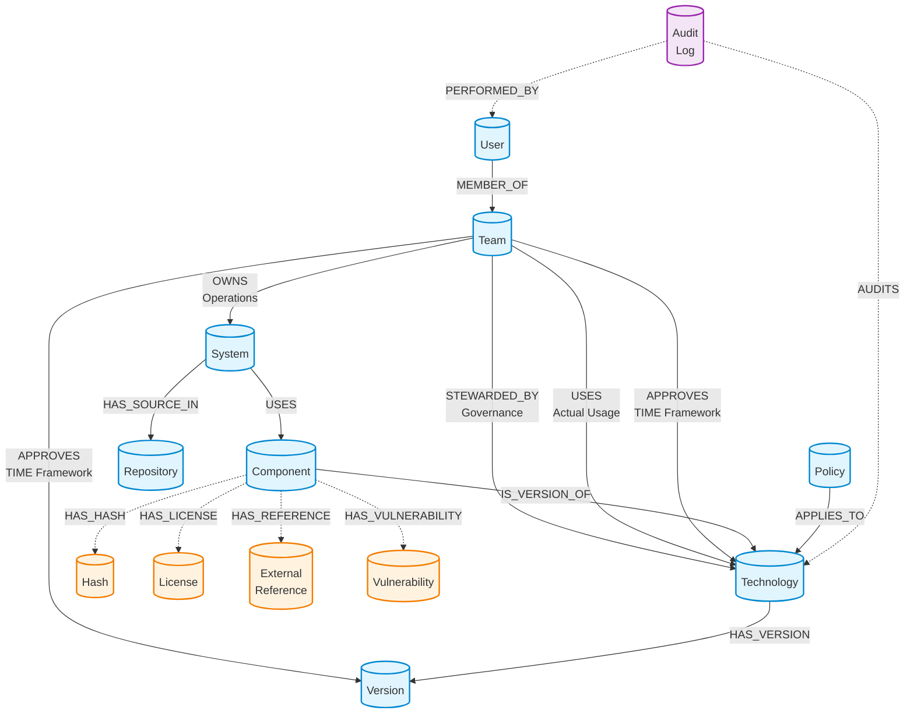

## Overview

Polaris uses a **graph database** to model your enterprise technology landscape. Unlike traditional databases that store data in tables, a graph database stores information as **nodes** (entities) and **relationships** (connections between entities).

### Why a Graph Database?

The graph structure is ideal for technology catalogs because:

1. **Natural Relationship Modeling** - Technology ecosystems are inherently interconnected. A graph naturally represents how teams own systems, systems use components, and components implement technologies.

2. **Flexible Queries** - You can easily answer questions like "Which teams are using deprecated technologies?" or "What systems will be affected if we retire this technology?" without complex joins.

3. **Evolving Schema** - As your technology landscape grows, you can add new relationship types without restructuring existing data.

4. **Compliance Tracking** - The graph makes it easy to identify violations by comparing actual usage (what teams use) against approvals (what teams have approved).

## Graph Visualization



## Core Entities

The graph model consists of six main entity types:

### Technology

Represents a **governed software entity** in your enterprise catalog - a strategic choice that requires governance oversight, approval processes, and lifecycle management.

**What qualifies as a Technology?**

Technologies are foundational software choices that:
- Require architectural approval and governance
- Have long-term strategic impact on the organization
- Need version management and security oversight
- Are subject to enterprise policies and standards

**Technology Categories:**

1. **Foundational Runtime or Framework** - Core execution environments and application frameworks
   - Examples: Node.js, React, Vue, Angular, Spring Boot
   - Impact: Defines application architecture and development patterns

2. **Data Platform** - Database systems and data storage technologies
   - Examples: PostgreSQL, MongoDB, Neo4j, Redis, Elasticsearch
   - Impact: Determines data architecture and persistence strategies

3. **Integration Platform** - Middleware and integration technologies
   - Examples: Kafka, RabbitMQ, API Gateway, GraphQL
   - Impact: Defines system integration patterns and data flow

4. **Security or Identity Tech** - Authentication, authorization, and security tools
   - Examples: OAuth2, Keycloak, Vault, LDAP
   - Impact: Determines security architecture and compliance

5. **Infrastructure / Container Tech** - Deployment and infrastructure technologies
   - Examples: Docker, Kubernetes, Terraform, AWS services
   - Impact: Defines deployment architecture and operational model

6. **Explicitly Disallowed or Deprecated** - Technologies that are banned or being phased out
   - Examples: jQuery (deprecated), Flash (disallowed), outdated frameworks
   - Impact: Prevents technical debt and security risks

**Key Information Tracked:**
- Basic details (name, description, category)
- Vendor/maintainer information
- Approved version ranges (using semantic versioning)
- External resources (homepage, documentation, repository)
- License information
- Risk assessment and review dates

**Important Note:** Technologies don't have a single "status" field. Instead, each team approves technologies with a TIME category (invest, migrate, tolerate, eliminate) via the APPROVES relationship. This allows different teams to have different policies for the same technology.

### Version

Represents a specific version of a technology with approval status and security information.

**What it tracks:**
- Version number (e.g., "18.2.0")
- Release and end-of-life dates
- Approval status
- Security vulnerability scores (CVSS)
- Additional notes and context

**Why it matters:** Version tracking enables you to identify systems using outdated or unsupported versions, helping you plan upgrades and maintain security. Teams can approve specific versions with different TIME categories.

### Component

Represents **software entities actually used in systems** - the concrete dependencies and packages discovered through SBOM (Software Bill of Materials) scanning.

**What is a Component?**

Components are concrete software artifacts that:
- Are discovered through SBOM scanning and dependency analysis
- Represent actual usage in one or more systems
- May or may not map to a governed Technology
- Include transitive dependencies and third-party libraries

**Component vs Technology:**

| Aspect | Technology | Component |
|--------|-----------|-----------|
| **Definition** | Governed strategic choice | Actual software artifact in use |
| **Governance** | Requires approval and oversight | Tracked for compliance |
| **Scope** | Enterprise-wide decision | System-specific dependency |
| **Examples** | "React" (framework choice) | "react@18.2.0" (npm package) |
| **Lifecycle** | Managed through policies | Discovered through scanning |

A Component may be an instance of a Technology (e.g., `react@18.2.0` is a component that implements the `React` technology), or it may be a transitive dependency that doesn't require governance approval.

**Key Information Tracked:**

*Core Identity:*
- Package name and version
- Package manager (npm, pip, maven, cargo, etc.)
- Package URL (purl) - universal identifier across ecosystems
- Component type (library, framework, application, etc.)
- Group/scope (e.g., `@company` for npm, `org.apache` for Maven)

*Security & Compliance:*
- Multiple cryptographic hashes (SHA-256, SHA-512) for integrity verification
- License information with SPDX identifiers
- Known security vulnerabilities with severity ratings
- Common Platform Enumeration (CPE) for vulnerability matching

*Provenance & Metadata:*
- Supplier, author, and publisher information
- Description and copyright details
- Homepage and documentation links
- Source repository and issue tracker URLs
- Release and publication dates

*Dependency Context:*
- Dependency scope (required, optional, dev, test)
- Whether it's a direct or transitive dependency
- Which systems are using this component

### System

Represents a deployable unit, service, or application in your organization.

**What it tracks:**
- System identity (name, description)
- Business domain
- Owning team
- Business criticality level (low, medium, high, critical)
- Deployment environment (dev, staging, production)
- Source code location

**Why it matters:** Systems are the high-level containers for your applications. They help organize components and show the bigger picture of your technology landscape. Understanding which team owns which systems enables accountability and proper governance.

### Team

Represents an organizational team with ownership and governance responsibilities.

**What it tracks:**
- Team identity (name, description)
- Contact information (email, Slack channel)
- Area of responsibility (frontend, backend, data, infrastructure, security)

**Why it matters:** Teams are the organizational unit for ownership and approvals. The graph model supports three distinct team responsibilities:
- **Stewardship** - Technical governance of technologies
- **Ownership** - Operational responsibility for systems
- **Approval** - Usage decisions for technologies

### Policy

Represents a governance rule for technology usage.

**What it tracks:**
- Policy details (name, description, type)
- Severity level (info, warning, error, critical)
- Effective date range
- Enforcing team
- Scope (organization, domain, team)
- Status (active, draft, archived)

**Why it matters:** Policies define your governance rules. They can require approval before using certain technologies, mark technologies as deprecated, enforce security standards, or implement other organizational requirements.

### Repository

Represents a source code repository where systems are developed.

**What it tracks:**
- Repository URL (e.g., GitHub, GitLab, Bitbucket)
- Repository type (git, svn, etc.)
- Default branch
- Visibility (public, private, internal)

**Why it matters:** Repositories are the source of truth for SBOM data. When you push an SBOM to Polaris with a repository URL, it automatically updates all systems that have their source code in that repository. This enables centralized dependency tracking across multiple systems from a single SBOM scan.

### SBOM-Related Entities

Polaris tracks additional information about components to support comprehensive Software Bill of Materials (SBOM) management:

#### Hash

Represents cryptographic hashes for verifying component integrity.

**What it tracks:**
- Hash algorithm (SHA-256, SHA-512, BLAKE3, etc.)
- Hash value (hex-encoded)

**Why it matters:** Hashes ensure that the component you're using hasn't been tampered with. Multiple hash algorithms provide defense-in-depth security. When you download a package, you can verify its integrity by comparing the hash.

#### License

Represents software licenses associated with components.

**What it tracks:**
- SPDX license identifier (e.g., MIT, Apache-2.0, GPL-3.0)
- License name and URL
- Full license text (optional)

**Why it matters:** License tracking helps you understand your legal obligations and ensure compliance. You can identify components with incompatible licenses, track copyleft requirements, and generate license reports for your products.

#### External Reference

Represents external resources related to components.

**What it tracks:**
- Reference type (vcs, website, documentation, issue-tracker, etc.)
- URL to the resource
- Optional description

**Why it matters:** External references help you find more information about components. You can quickly navigate to the source code repository, read documentation, report issues, or visit the project website.

#### Vulnerability

Represents known security vulnerabilities affecting components.

**What it tracks:**
- Vulnerability ID (CVE, GHSA, OSV, etc.)
- Source (NVD, GitHub Security Advisories, OSV database)
- Description and remediation recommendations
- Severity rating (critical, high, medium, low)
- CVSS score (0-10 scale)
- Analysis state (exploitable, in_triage, false_positive, not_affected)

**Why it matters:** Vulnerability tracking helps you identify and remediate security issues in your dependencies. You can prioritize fixes based on severity, track remediation progress, and ensure your systems are protected against known threats.

## Relationships

The power of the graph model lies in its relationships. Here are the key connections:

### Understanding STEWARDED_BY vs OWNS vs USES vs APPROVES

These four relationship types represent different aspects of team responsibility:

**STEWARDED_BY (Team → Technology)**
- **Purpose:** Technical stewardship and governance responsibility
- **Cardinality:** One team stewards each technology
- **Responsibilities:**
  - Maintaining technology standards
  - Evaluating new versions
  - Setting version ranges
  - Risk assessment
  - Documentation and best practices
- **Note:** This is governance responsibility, not operational ownership

**OWNS (Team → System)**
- **Purpose:** Operational ownership and responsibility
- **Cardinality:** One team owns each system
- **Responsibilities:**
  - Running and maintaining the system
  - System lifecycle management
  - Operational support
  - Deployment and updates
- **Note:** This is operational responsibility, not governance

**USES (Team → Technology)**
- **Purpose:** Tracks actual technology usage by teams
- **Cardinality:** Many-to-many (multiple teams can use the same technology)
- **How it works:** Automatically inferred from system ownership and component dependencies
  - Team → System → Component → Technology
- **Properties tracked:**
  - When the team first started using this technology
  - When the usage was last verified
  - Number of systems using this technology
- **Why it matters:** Enables compliance checking by comparing actual usage against approvals

**APPROVES (Team → Technology or Version)**
- **Purpose:** Usage approval with TIME framework categorization
- **Cardinality:** Many-to-many (multiple teams can approve the same technology)
- **How it works:** Each team independently decides whether to use a technology
- **Properties tracked:**
  - TIME category (invest, migrate, tolerate, eliminate)
  - Approval timestamp and approver
  - Deprecation date and end-of-life date
  - Migration target (for technologies being phased out)
  - Version constraints
  - Additional notes
- **Why it matters:** Enables decentralized decision-making while maintaining governance

**Example Scenario:**
- TypeScript is **STEWARDED BY** Frontend Platform (technical governance)
- Customer Portal system is **OWNED BY** Frontend Platform (operational responsibility)
- TypeScript is **USED** by Frontend Platform (3 systems) AND Backend Platform (5 systems)
- TypeScript is **APPROVED** by Frontend Platform (time: invest) AND Backend Platform (time: invest)

### Other Key Relationships

**HAS_VERSION (Technology → Version)**
- Links technologies to their specific versions
- Enables version-specific approvals and policies

**IS_VERSION_OF (Component → Technology)**
- Links components that implement governed technologies
- **Optional relationship** - not all components map to technologies
- When present: Component is subject to technology approval policies
- When absent: Component is a transitive dependency or utility library tracked for security/licensing but not governance

**USES (System → Component)**
- Links systems to the components they depend on
- Discovered through SBOM scanning
- Foundation for understanding technology usage

**APPLIES_TO (Policy → Technology)**
- Links policies to the technologies they govern
- Enables technology-specific governance rules

**HAS_SOURCE_IN (System → Repository)**
- Links systems to their source code repositories
- Enables automatic SBOM updates for all systems in a repository
- Supports many-to-many relationships (monorepos can contain multiple systems)

### SBOM Relationships

These relationships connect components to their detailed metadata:

**HAS_HASH (Component → Hash)**
- Links components to their cryptographic hashes
- Multiple hashes per component (SHA-256, SHA-512, etc.)
- Enables integrity verification

**HAS_LICENSE (Component → License)**
- Links components to their software licenses
- Multiple licenses per component (dual-licensed software)
- Enables license compliance tracking

**HAS_REFERENCE (Component → External Reference)**
- Links components to external resources
- Multiple references per component (source code, docs, issues)
- Enables quick navigation to component information

**HAS_VULNERABILITY (Component → Vulnerability)**
- Links components to known security vulnerabilities
- Multiple vulnerabilities per component
- Enables security risk assessment and remediation tracking

## Governance Models

### Stewardship vs Ownership vs Approval

Polaris uses a **centralized stewardship, decentralized approval** model with clear separation between technical governance and operational ownership:

#### Stewardship (Centralized Technical Governance)

**One team stewards each technology** and is responsible for:
- Setting approved version ranges
- Evaluating security vulnerabilities
- Maintaining documentation and best practices
- Assessing risk levels
- Reviewing and updating technology standards

**Example:**
- Frontend Platform **stewards** TypeScript
- Frontend Platform sets approved version range: ">=5.0.0 <6.0.0"
- Frontend Platform maintains TypeScript coding standards

#### Ownership (Operational Responsibility)

**One team owns each system** and is responsible for:
- Running and maintaining the system
- System lifecycle management
- Operational support and monitoring
- Deployment and updates

**Example:**
- Frontend Platform **owns** Customer Portal system
- Backend Platform **owns** API Gateway system

#### Approval (Decentralized Usage)

**Multiple teams can approve the same technology** for their use:
- Each team independently decides whether to use the technology
- Teams can have different TIME categories for the same technology
- Teams can set additional version constraints
- Teams can have different migration timelines

**Example:**
- Frontend Platform **approves** TypeScript (time: invest, notes: "Required for all new frontend projects")
- Backend Platform **approves** TypeScript (time: invest, notes: "Required for all backend services")
- Data Platform might **not approve** TypeScript (no APPROVES relationship = eliminate)

### Real-World Scenario: Java

**Stewardship:**
- Backend Platform **stewards** Java
- Sets approved version range: ">=17 <22"
- Maintains Java coding standards
- Evaluates security patches

**Approvals:**
- Backend Platform **approves** Java (time: invest, versionConstraint: ">=17")
- Data Platform **approves** Java (time: tolerate, versionConstraint: ">=11", notes: "Legacy batch jobs only")
- Frontend Platform **does not approve** Java (no relationship = eliminate, use TypeScript instead)

## Technology vs Component: Understanding the Distinction

### Conceptual Model


### Key Differences

**Technology (Governance Layer):**
- Strategic architectural decision
- Requires approval and policy compliance
- Managed through TIME framework (invest, migrate, tolerate, eliminate)
- Subject to version constraints and security reviews
- Example: "We approve React as our frontend framework"

**Component (Usage Layer):**
- Concrete implementation discovered in systems
- Actual package/dependency in use
- Tracked through SBOM scanning
- May include transitive dependencies
- Example: "System X uses react@18.2.0 from npm"

### Relationship Flow

1. **Governance Decision**: Team approves a Technology (e.g., React)
2. **Implementation**: Developers use Components that implement that Technology (e.g., react@18.2.0)
3. **Discovery**: SBOM scanning discovers Components in Systems
4. **Compliance Check**: Components are validated against approved Technologies
5. **Violation Detection**: Components without corresponding Technology approval are flagged

### Example Scenarios

**Scenario 1: Compliant Usage**
```
Technology: React (approved by Frontend Platform)
Component: react@18.2.0 (used in Customer Portal)
Status: ✅ Compliant - Component version within approved range
```

**Scenario 2: Version Violation**
```
Technology: React (approved range: >=18.0.0 <19.0.0)
Component: react@17.0.2 (used in Legacy App)
Status: ⚠️ Warning - Component version outside approved range
```

**Scenario 3: Unapproved Technology**
```
Technology: jQuery (deprecated, not approved)
Component: jquery@3.6.0 (used in Admin Dashboard)
Status: ❌ Violation - Using deprecated technology without approval
```

**Scenario 4: Transitive Dependency**
```
Technology: N/A (not a governed technology)
Component: lodash@4.17.21 (transitive dependency)
Status: ℹ️ Tracked - Not subject to governance, but monitored for security
```

### SBOM Data Flow

Understanding how SBOM data flows through Polaris helps you see the complete picture from code to compliance:

**1. Development & Build**
- Developers write code and declare dependencies
- Build tools create SBOM files (SPDX or CycloneDX format)
- SBOM includes all direct and transitive dependencies

**2. SBOM Ingestion**
- CI/CD pipeline pushes SBOM to Polaris with repository URL
- Polaris identifies all systems with source code in that repository
- Components are created or updated with rich metadata:
  - Package URLs (purl) for universal identification
  - Multiple cryptographic hashes for integrity
  - License information with SPDX identifiers
  - External references (source code, docs, issues)
  - Supplier and provenance information

**3. Relationship Building**
- Components are linked to all systems in the repository
- Components are matched to governed Technologies (when applicable)
- Hashes, licenses, and references are linked to components
- Vulnerabilities are matched using CPE identifiers

**4. Compliance Analysis**
- Components are checked against team approvals
- Version constraints are validated
- License compatibility is assessed
- Security vulnerabilities are identified

**5. Reporting & Action**
- Violations are surfaced to teams
- Security alerts are generated for critical vulnerabilities
- License compliance reports are available
- Remediation guidance is provided

**Example Flow:**
```
Repository: github.com/company/api-gateway
Systems: API Gateway, Auth Service, Rate Limiter

SBOM Pushed → 3 Systems Updated → 150 Components Discovered
  ├─ 45 Components mapped to approved Technologies ✅
  ├─ 100 Components are transitive dependencies ℹ️
  ├─ 3 Components have known vulnerabilities ⚠️
  └─ 2 Components use unapproved Technologies ❌
```

## Policy Governance Model

### Policy Enforcement Architecture

Polaris implements a **team-based policy enforcement model** that enables sophisticated governance rules:

#### Policy Lifecycle

**Effective Dates:**
- Policies have `effectiveDate` (when they become active)
- Policies can have `expiryDate` (when they expire, or null for no expiry)
- Policies have `status` (active, draft, archived)

**Enforcement:**
- Each policy specifies which team is responsible for enforcement
- Policies have a `scope` (organization, domain, team)
- Policies have a `severity` level (info, warning, error, critical)

#### Policy Scopes

**Organization Scope:**
- Applies to all teams in the organization
- Example: "All teams must use approved technologies"

**Domain Scope:**
- Applies to teams in a specific domain (frontend, backend, data, etc.)
- Example: "Frontend teams must use TypeScript"

**Team Scope:**
- Applies to a specific team
- Example: "Frontend Platform must review all new framework proposals"

### Example: Security Policy

**Policy:** High Risk Technology Review

**Configuration:**
- Effective date: 2025-01-01
- Enforced by: Security team
- Scope: Organization-wide
- Status: Active
- Severity: Error

**How it works:**
1. Security team enforces the policy
2. All teams are subject to the policy
3. Policy governs high-risk technologies
4. Violations are flagged as errors
5. Teams must get Security approval before using high-risk technologies

## TIME Framework

The TIME framework categorizes technologies based on their strategic value and lifecycle stage:

### TIME Categories

**Invest** - Technologies we're actively investing in
- Strategic importance: High
- Support level: Full support and training
- Usage: Encouraged for new projects
- Example: React, TypeScript, Kubernetes

**Tolerate** - Technologies we accept but don't promote
- Strategic importance: Medium
- Support level: Maintenance mode
- Usage: Allowed for existing projects, not recommended for new ones
- Example: Angular (if migrating to React), older Java versions

**Migrate** - Technologies we're actively moving away from
- Strategic importance: Low
- Support level: Migration support only
- Usage: Discouraged, migration plan required
- Example: jQuery, legacy frameworks

**Eliminate** - Technologies we don't allow
- Strategic importance: None
- Support level: No support
- Usage: Blocked, must be removed
- Example: Flash, severely outdated versions with security issues

### Team-Specific TIME Categories

Different teams can assign different TIME categories to the same technology based on their needs:

**Example: Angular**
- Frontend Platform: **Migrate** (moving to React)
- Legacy Systems Team: **Tolerate** (maintaining existing apps)
- Mobile Team: **Eliminate** (never used, not planning to use)

This flexibility allows teams to manage their own technology transitions while maintaining overall governance.

## Compliance and Violation Detection

### How Compliance Works

Polaris automatically detects compliance violations by comparing:
1. **What teams are using** (USES relationships from SBOM scanning)
2. **What teams have approved** (APPROVES relationships)

### Violation Types

**Unapproved Technology Usage**
- Team is using a technology they haven't approved
- Severity: High
- Action: Team must either approve the technology or remove it

**Version Constraint Violation**
- Team is using a version outside their approved range
- Severity: Medium to High
- Action: Upgrade/downgrade to approved version

**Deprecated Technology Usage**
- Team is using a technology marked as "migrate" or "eliminate"
- Severity: Medium (migrate) to Critical (eliminate)
- Action: Follow migration plan or remove immediately

**Policy Violation**
- Team is violating an active policy
- Severity: Depends on policy severity
- Action: Comply with policy requirements

### Compliance Dashboard Capabilities

The Polaris UI provides visibility into:
- Technologies used without approval
- Systems using deprecated technologies
- Version compliance status
- Policy violations by team
- Migration progress tracking
- Security vulnerability exposure

## Universal Component Identification

### Package URLs (purl)

Polaris uses **Package URLs (purl)** as the universal identifier for components across all package ecosystems.

**What is a purl?**

A Package URL is a standardized way to identify software packages regardless of where they come from. It has a simple format:

```
pkg:type/namespace/name@version
```

**Examples:**
- npm: `pkg:npm/react@18.2.0`
- Maven: `pkg:maven/org.springframework.boot/spring-boot-starter-web@3.1.0`
- PyPI: `pkg:pypi/django@4.2.0`
- Docker: `pkg:docker/library/nginx@1.25.0`
- Generic: `pkg:generic/openssl@3.0.0`

**Why purl matters:**

1. **Universal Deduplication** - The same component from different SBOMs is recognized as identical
2. **Cross-Ecosystem Tracking** - Track components consistently across npm, Maven, PyPI, etc.
3. **Vulnerability Matching** - Security databases use purl for precise vulnerability identification
4. **License Compliance** - Identify the exact package for license obligations
5. **Supply Chain Security** - Track component provenance across your entire organization

**How Polaris uses purl:**
- Primary identifier for all components
- Enables automatic merging of SBOM data from multiple sources
- Links components to vulnerability databases
- Supports dependency graph analysis across ecosystems

### Common Platform Enumeration (CPE)

In addition to purl, Polaris tracks **CPE identifiers** for components when available.

**What is CPE?**

CPE is a standardized naming scheme for IT systems, software, and packages used by security databases like the National Vulnerability Database (NVD).

**Example:**
```
cpe:2.3:a:facebook:react:18.2.0:*:*:*:*:*:*:*
```

**Why CPE matters:**
- Used by NVD and other vulnerability databases
- Enables automatic vulnerability matching
- Provides additional security context

## Audit Trail System

Polaris includes a comprehensive audit trail system that tracks all data changes across the platform. This enables compliance, security auditing, and understanding how your technology catalog evolves over time.

### AuditLog Entity

Represents a record of a data change in the system.

**What it tracks:**
- **Identity**: Unique ID and timestamp
- **Operation**: Type of operation (CREATE, UPDATE, DELETE, APPROVE, etc.)
- **Entity**: What was changed (type and ID)
- **Actor**: Who made the change (user information)
- **Changes**: Field-level before/after values
- **Context**: Source, IP address, session, reason

**Why it matters:** Audit logs provide accountability and traceability for all data modifications. They help answer questions like "Who approved this technology?", "What changed before the system broke?", and "When was this vulnerability detected?"

### User Entity

Represents authenticated users who interact with the system.

**What it tracks:**
- User identity (ID, email, name)
- Authentication provider (GitHub, Google, etc.)
- Role (user, admin, superuser)
- Login history

**Why it matters:** Users are the actors in the audit trail. Understanding who made changes and when they last logged in is essential for security and compliance.

### Audit Relationships

**PERFORMED_BY**
- Links audit logs to the users who performed the actions
- Direction: `(AuditLog)-[:PERFORMED_BY]->(User)`
- Enables querying all actions by a specific user

**AUDITS** (optional)
- Links audit logs directly to the entities they track
- Direction: `(AuditLog)-[:AUDITS]->(Entity)`
- Enables direct navigation from entity to its complete audit history

**MEMBER_OF**
- Links users to their teams
- Direction: `(User)-[:MEMBER_OF]->(Team)`
- Enables team-based access control

### Audit Operation Types

**Standard Operations:**
- `CREATE`, `UPDATE`, `DELETE`, `RESTORE` - CRUD operations
- `APPROVE`, `REJECT`, `REVOKE` - Approval operations
- `LINK`, `UNLINK` - Relationship operations
- `ACTIVATE`, `DEACTIVATE`, `ARCHIVE` - Status changes

**User Operations:**
- `LOGIN`, `LOGOUT`, `ROLE_CHANGE` - User activity

**SBOM Operations:**
- `SBOM_UPLOAD`, `COMPONENT_DISCOVERED`, `VULNERABILITY_DETECTED`, `VULNERABILITY_RESOLVED`

### Common Audit Queries

**Who approved this technology?**
```cypher
MATCH (a:AuditLog)-[:PERFORMED_BY]->(u:User)
WHERE a.entityType = 'Technology' 
  AND a.entityId = 'React'
  AND a.operation = 'APPROVE'
RETURN a.timestamp, u.name, a.reason
ORDER BY a.timestamp DESC
```

**What changed recently?**
```cypher
MATCH (a:AuditLog)
WHERE a.timestamp >= datetime() - duration('P7D')
RETURN a
ORDER BY a.timestamp DESC
```

**Track system ownership changes:**
```cypher
MATCH (a:AuditLog)
WHERE a.entityType = 'System' 
  AND 'ownerTeam' IN a.changedFields
RETURN a.timestamp, 
       a.changes.ownerTeam.before as oldOwner,
       a.changes.ownerTeam.after as newOwner
ORDER BY a.timestamp DESC
```

### Audit Trail Benefits

1. **Compliance**: Maintain detailed records for SOC 2, GDPR, HIPAA, PCI DSS
2. **Security**: Track unauthorized access attempts and suspicious changes
3. **Debugging**: Understand what changed before an incident occurred
4. **Analytics**: Analyze user behavior and system usage patterns
5. **Accountability**: Know who made each change and why

For more detailed information, see the [Audit Trail Documentation](/schema/schema/README_AUDIT_TRAIL.md).

## Summary

The Polaris graph model provides:

1. **Clear Separation of Concerns**
   - Stewardship (technical governance)
   - Ownership (operational responsibility)
   - Approval (usage decisions)

2. **Flexible Governance**
   - Centralized stewardship for consistency
   - Decentralized approvals for autonomy
   - Team-specific TIME categories

3. **Automatic Compliance**
   - SBOM scanning discovers actual usage
   - Automatic comparison against approvals
   - Real-time violation detection

4. **Strategic Technology Management**
   - TIME framework for lifecycle management
   - Version-specific approvals
   - Migration planning and tracking

5. **Policy Enforcement**
   - Team-based enforcement model
   - Scoped policies (organization, domain, team)
   - Severity-based prioritization

6. **Comprehensive SBOM Support**
   - Standards-compliant (SPDX 2.3, CycloneDX 1.5)
   - Universal component identification (purl, CPE)
   - Rich metadata (hashes, licenses, vulnerabilities)
   - Automatic repository-to-system mapping

7. **Complete Audit Trail**
   - Track all data changes with detailed context
   - User-level accountability for compliance
   - Field-level change tracking with before/after values
   - Comprehensive operation logging (CRUD, approvals, SBOM)

This model enables organizations to maintain governance and compliance while giving teams the autonomy to make technology decisions appropriate for their context.
