## Overview

Polaris uses a **Neo4j graph database** to model the enterprise technology landscape. The graph structure captures relationships between technologies, teams, systems, and policies, enabling powerful queries about dependencies, ownership, and compliance.

## Graph Visualization

```mermaid
graph TB
    %% Node Definitions
    Team[("Team<br/>━━━━━━━<br/>name*<br/>email<br/>responsibilityArea")]
    Technology[("Technology<br/>━━━━━━━<br/>name*<br/>category<br/>vendor<br/>approvedVersionRange<br/>ownerTeam<br/>riskLevel<br/>lastReviewed")]
    Version[("Version<br/>━━━━━━━<br/>technologyName*<br/>version*<br/>releaseDate<br/>eolDate<br/>approved<br/>cvssScore<br/>notes")]
    Component[("Component<br/>━━━━━━━<br/>name*<br/>version*<br/>packageManager*<br/>license<br/>sourceRepo<br/>importPath<br/>hash")]
    System[("System<br/>━━━━━━━<br/>name*<br/>domain<br/>ownerTeam<br/>businessCriticality<br/>environment")]
    Policy[("Policy<br/>━━━━━━━<br/>name*<br/>description<br/>ruleType<br/>severity")]
    
    %% Relationships
    Team -->|"OWNS<br/>(1:N)<br/>Governance"| Technology
    Team -->|"OWNS<br/>(1:N)<br/>Governance"| System
    Team -->|"APPROVES<br/>(M:N)<br/>{time, approvedAt,<br/>eolDate, migrationTarget,<br/>notes, approvedBy,<br/>versionConstraint}"| Technology
    Team -->|"APPROVES<br/>(M:N)<br/>{time, approvedAt,<br/>eolDate, migrationTarget,<br/>notes, approvedBy}"| Version
    
    Technology -->|"HAS_VERSION"| Version
    
    Component -->|"IS_VERSION_OF"| Technology
    
    System -->|"USES"| Component
    
    Policy -->|"APPLIES_TO"| Technology
    
    %% Styling
    classDef nodeStyle fill:#e1f5ff,stroke:#0288d1,stroke-width:2px
    classDef relationshipStyle fill:#fff3e0,stroke:#f57c00,stroke-width:2px
    
    class Team,Technology,Version,Component,System,Policy nodeStyle
```



## Node Types

### 1. Technology

Represents approved technologies in the enterprise catalog.

**Properties:**
- `name` (string, unique) - Technology name (e.g., "React", "PostgreSQL")
- `category` (string) - Technology category (e.g., "framework", "database")
- `vendor` (string) - Vendor or maintainer (e.g., "Meta", "PostgreSQL Global Development Group")
- `approvedVersionRange` (string) - Semver range (e.g., ">=18.0.0 <19.0.0")
- `ownerTeam` (string) - Team responsible for governance
- `riskLevel` (string) - Risk assessment (low, medium, high, critical)
- `lastReviewed` (date) - Last review date

**Indexes:**
- `technology_name_unique` (constraint)
- `technology_category`
- `technology_owner_team`
- `technology_risk_level`

**Example:**
```cypher
CREATE (t:Technology {
  name: "React",
  category: "framework",
  vendor: "Meta",
  approvedVersionRange: ">=18.0.0 <19.0.0",
  ownerTeam: "Frontend Platform",
  riskLevel: "low",
  lastReviewed: date("2025-10-01")
})
```

### 2. Version

Represents specific versions of technologies with approval status and security information.

**Properties:**
- `technologyName` (string, composite unique) - Parent technology name
- `version` (string, composite unique) - Version number (e.g., "18.2.0")
- `releaseDate` (date) - Release date
- `eolDate` (date) - End-of-life date
- `approved` (boolean) - Approval status
- `cvssScore` (float) - Security vulnerability score
- `notes` (string) - Additional notes

**Indexes:**
- `version_tech_version_unique` (constraint on technologyName + version)
- `version_approved`
- `version_eol_date`
- `version_release_date`

**Example:**
```cypher
CREATE (v:Version {
  technologyName: "React",
  version: "18.2.0",
  releaseDate: date("2023-06-14"),
  eolDate: date("2025-12-31"),
  approved: true,
  cvssScore: 0.0,
  notes: "Stable LTS version"
})
```

### 3. Component

Represents SBOM (Software Bill of Materials) entries - dependencies used in systems.

**Properties:**
- `name` (string, composite unique) - Package name
- `version` (string, composite unique) - Package version
- `packageManager` (string, composite unique) - Package manager (npm, pip, maven, etc.)
- `license` (string) - License type (MIT, Apache-2.0, etc.)
- `sourceRepo` (string) - Source repository URL
- `importPath` (string) - Import path in code
- `hash` (string) - Package integrity hash

**Indexes:**
- `component_name_version_pm_unique` (constraint)
- `component_package_manager`
- `component_license`
- `component_hash`

**Example:**
```cypher
CREATE (c:Component {
  name: "react",
  version: "18.2.0",
  packageManager: "npm",
  license: "MIT",
  sourceRepo: "https://github.com/facebook/react",
  importPath: "react",
  hash: "sha512-..."
})
```

### 4. System

Represents deployable units, services, or applications.

**Properties:**
- `name` (string, unique) - System name
- `domain` (string) - Business domain (e.g., "customer-portal", "api-gateway")
- `ownerTeam` (string) - Team responsible for the system
- `businessCriticality` (string) - Business impact (low, medium, high, critical)
- `environment` (string) - Deployment environment (dev, staging, production)

**Indexes:**
- `system_name_unique` (constraint)
- `system_domain`
- `system_owner_team`
- `system_business_criticality`
- `system_environment`

**Example:**
```cypher
CREATE (s:System {
  name: "Customer Portal",
  domain: "customer-experience",
  ownerTeam: "Frontend Platform",
  businessCriticality: "high",
  environment: "production"
})
```

### 5. Policy

Represents governance and compliance rules.

**Properties:**
- `name` (string, unique) - Policy name
- `description` (string) - Policy description
- `ruleType` (string) - Type of rule (security, compliance, performance, etc.)
- `severity` (string) - Severity level (info, warning, error, critical)

**Indexes:**
- `policy_name_unique` (constraint)
- `policy_rule_type`
- `policy_severity`

**Example:**
```cypher
CREATE (p:Policy {
  name: "No Deprecated Dependencies",
  description: "Systems must not use deprecated technology versions",
  ruleType: "compliance",
  severity: "error"
})
```

### 6. Team

Represents organizational teams with ownership responsibilities.

**Properties:**
- `name` (string, unique) - Team name
- `email` (string) - Contact email
- `responsibilityArea` (string) - Area of responsibility (frontend, backend, data, infrastructure, security)

**Indexes:**
- `team_name_unique` (constraint)
- `team_email`
- `team_responsibility_area`

**Example:**
```cypher
CREATE (t:Team {
  name: "Frontend Platform",
  email: "frontend-platform@company.com",
  responsibilityArea: "frontend"
})
```

## Relationships

### Understanding OWNS vs APPROVES

**Important Distinction:**

- **OWNS**: Governance responsibility - ONE team owns a technology and is responsible for:
  - Maintaining technology standards
  - Evaluating new versions
  - Setting version ranges
  - Risk assessment
  - Documentation and best practices

- **APPROVES**: Usage approval - MULTIPLE teams can approve the same technology for their use with different TIME categories:
  - Each team decides if they want to use the technology
  - Teams can have different TIME categories (invest, migrate, tolerate, eliminate)
  - Teams can approve different versions
  - Teams can set their own version constraints

**Example:**
- TypeScript is **OWNED** by Frontend Platform (governance)
- TypeScript is **APPROVED** by Frontend Platform (time: invest) AND Backend Platform (time: invest)

### 1. OWNS (Team → Technology)

**Cardinality:** One-to-Many (One team owns a technology, but a team can own many technologies)

**Purpose:** Establishes governance responsibility for a technology.

**Properties:** None

**Example:**
```cypher
MATCH (team:Team {name: "Frontend Platform"})
MATCH (tech:Technology {name: "React"})
CREATE (team)-[:OWNS]->(tech)
```

**Note:** The `ownerTeam` property on Technology nodes duplicates this relationship for query performance.

### 2. OWNS (Team → System)

Teams own and maintain systems.

**Properties:** None

**Example:**
```cypher
MATCH (team:Team {name: "Frontend Platform"})
MATCH (sys:System {name: "Customer Portal"})
CREATE (team)-[:OWNS]->(sys)
```

### 3. APPROVES (Team → Technology)

**Cardinality:** Many-to-Many (Multiple teams can approve the same technology, each team can approve many technologies)

**Purpose:** Establishes usage approval with TIME framework categorization. Each team independently decides whether to use a technology.

**Properties:**
- `time` (string) - TIME category: tolerate, invest, migrate, eliminate
- `approvedAt` (datetime) - Approval timestamp
- `deprecatedAt` (datetime) - Deprecation timestamp
- `eolDate` (date) - End-of-life date
- `migrationTarget` (string) - Target technology for migration
- `notes` (string) - Additional context
- `approvedBy` (string) - Approver name
- `versionConstraint` (string) - Version constraint (e.g., ">=18")

**Indexes:**
- `approves_time`
- `approves_eol_date`
- `approves_approved_at`

**Example - Single Team Approval:**
```cypher
MATCH (team:Team {name: "Frontend Platform"})
MATCH (tech:Technology {name: "Angular"})
CREATE (team)-[:APPROVES {
  time: "migrate",
  approvedAt: datetime(),
  deprecatedAt: datetime("2024-06-01T00:00:00Z"),
  eolDate: date("2025-12-31"),
  migrationTarget: "React",
  notes: "Migrating to React for better ecosystem support",
  approvedBy: "Frontend Lead"
}]->(tech)
```

**Example - Multiple Teams Approving Same Technology:**
```cypher
// TypeScript approved by Frontend Platform
MATCH (frontend:Team {name: "Frontend Platform"})
MATCH (ts:Technology {name: "TypeScript"})
CREATE (frontend)-[:APPROVES {
  time: "invest",
  approvedAt: datetime(),
  notes: "Required for all new frontend projects",
  approvedBy: "Frontend Lead"
}]->(ts)

// TypeScript also approved by Backend Platform
MATCH (backend:Team {name: "Backend Platform"})
MATCH (ts:Technology {name: "TypeScript"})
CREATE (backend)-[:APPROVES {
  time: "invest",
  approvedAt: datetime(),
  notes: "Required for all backend services",
  approvedBy: "Backend Lead"
}]->(ts)
```

### 4. APPROVES (Team → Version)

Teams approve specific versions with TIME framework categorization.

**Properties:**
- `time` (string) - TIME category: tolerate, invest, migrate, eliminate
- `approvedAt` (datetime) - Approval timestamp
- `deprecatedAt` (datetime) - Deprecation timestamp
- `eolDate` (date) - End-of-life date
- `migrationTarget` (string) - Target version for migration
- `notes` (string) - Additional context
- `approvedBy` (string) - Approver name

**Example:**
```cypher
MATCH (team:Team {name: "Frontend Platform"})
MATCH (tech:Technology {name: "React"})
MATCH (tech)-[:HAS_VERSION]->(v:Version {version: "18.2.0"})
CREATE (team)-[:APPROVES {
  time: "invest",
  approvedAt: datetime(),
  notes: "Current stable version",
  approvedBy: "Frontend Lead"
}]->(v)
```

### 5. HAS_VERSION (Technology → Version)

Technologies have specific versions.

**Properties:** None

**Example:**
```cypher
MATCH (tech:Technology {name: "React"})
MATCH (v:Version {technologyName: "React", version: "18.2.0"})
CREATE (tech)-[:HAS_VERSION]->(v)
```

### 6. IS_VERSION_OF (Component → Technology)

Components are specific versions of technologies.

**Properties:** None

**Example:**
```cypher
MATCH (comp:Component {name: "react", version: "18.2.0", packageManager: "npm"})
MATCH (tech:Technology {name: "React"})
CREATE (comp)-[:IS_VERSION_OF]->(tech)
```

### 7. USES (System → Component)

Systems use components as dependencies.

**Properties:** None

**Example:**
```cypher
MATCH (sys:System {name: "Customer Portal"})
MATCH (comp:Component {name: "react", version: "18.2.0", packageManager: "npm"})
CREATE (sys)-[:USES]->(comp)
```

### 8. APPLIES_TO (Policy → Technology)

Policies apply to technologies.

**Properties:** None

**Example:**
```cypher
MATCH (policy:Policy {name: "No Deprecated Dependencies"})
MATCH (tech:Technology {name: "React"})
CREATE (policy)-[:APPLIES_TO]->(tech)
```

## Ownership vs Approval Model

### Governance Model

Polaris uses a **centralized governance, decentralized approval** model:

#### Ownership (Centralized Governance)

**One team owns each technology** and is responsible for:
- Setting approved version ranges
- Evaluating security vulnerabilities
- Maintaining documentation and best practices
- Assessing risk levels
- Reviewing and updating technology standards

**Example:**
- Frontend Platform **owns** TypeScript
- Frontend Platform sets `approvedVersionRange: ">=5.0.0 <6.0.0"`
- Frontend Platform maintains TypeScript coding standards

#### Approval (Decentralized Usage)

**Multiple teams can approve the same technology** for their use:
- Each team independently decides whether to use the technology
- Teams can have different TIME categories for the same technology
- Teams can set additional version constraints
- Teams can have different migration timelines

**Example:**
- Frontend Platform **approves** TypeScript (time: invest, notes: "Required for all new frontend projects")
- Backend Platform **approves** TypeScript (time: invest, notes: "Required for all backend services")
- Data Platform might **not approve** TypeScript (no APPROVES relationship = eliminate)

### Real-World Scenario

**Technology:** Java

**Ownership:**
- Backend Platform **owns** Java
- Sets `approvedVersionRange: ">=17 <22"`
- Maintains Java coding standards
- Evaluates security patches

**Approvals:**
- Backend Platform **approves** Java (time: invest, versionConstraint: ">=17")
- Data Platform **approves** Java (time: tolerate, versionConstraint: ">=11", notes: "Legacy batch jobs only")
- Frontend Platform **does not approve** Java (no relationship = eliminate, use TypeScript instead)

### Visual Example


In this example:
- **Frontend Platform** owns TypeScript (governance responsibility)
- **Frontend Platform** approves TypeScript for their use (time: invest)
- **Backend Platform** also approves TypeScript for their use (time: invest)
- Both teams can use TypeScript, but Frontend Platform is responsible for governance

### Query Examples

**Find who owns a technology:**
```cypher
MATCH (team:Team)-[:OWNS]->(tech:Technology {name: "TypeScript"})
RETURN team.name as owner
// Result: "Frontend Platform"
```

**Find all teams that approve a technology:**
```cypher
MATCH (team:Team)-[a:APPROVES]->(tech:Technology {name: "TypeScript"})
RETURN team.name as team, a.time as timeCategory, a.notes as notes
// Results:
// "Frontend Platform", "invest", "Required for all new frontend projects"
// "Backend Platform", "invest", "Required for all backend services"
```

**Find technologies a team can use:**
```cypher
MATCH (team:Team {name: "Backend Platform"})-[a:APPROVES]->(tech:Technology)
WHERE a.time IN ['invest', 'tolerate']
RETURN tech.name, a.time, a.versionConstraint
```

## TIME Framework

The APPROVES relationship uses **Gartner's TIME framework** for technology portfolio management:

- 🟢 **Invest**: Strategic technologies worth continued investment
- 🔵 **Migrate**: Technologies to move to newer platforms
- 🟡 **Tolerate**: Keep running but minimize investment
- 🔴 **Eliminate**: Phase out and decommission

See [TIME Framework Guide](./TIME_FRAMEWORK.md) for detailed information.

## Common Query Patterns

### 1. Find All Technologies Owned by a Team

```cypher
MATCH (team:Team {name: "Frontend Platform"})-[:OWNS]->(tech:Technology)
RETURN tech.name, tech.category, tech.riskLevel
ORDER BY tech.name
```

### 2. Find All Systems Using a Technology

```cypher
MATCH (tech:Technology {name: "React"})<-[:IS_VERSION_OF]-(comp:Component)<-[:USES]-(sys:System)
RETURN DISTINCT sys.name, sys.domain, sys.businessCriticality
ORDER BY sys.businessCriticality DESC
```

### 3. Find Technologies Approaching EOL

```cypher
MATCH (team:Team)-[a:APPROVES]->(tech:Technology)
WHERE a.eolDate IS NOT NULL
  AND a.eolDate < date() + duration({days: 90})
RETURN team.name, tech.name, a.time, a.eolDate, a.migrationTarget
ORDER BY a.eolDate
```

### 4. Find All Approvals for a Team

```cypher
MATCH (team:Team {name: "Frontend Platform"})-[a:APPROVES]->(target)
RETURN 
  labels(target)[0] as targetType,
  target.name as name,
  CASE WHEN 'Version' IN labels(target) THEN target.version ELSE null END as version,
  a.time as timeCategory,
  a.notes as notes
ORDER BY a.time, name
```

### 5. Check Approval Hierarchy

```cypher
MATCH (team:Team {name: "Frontend Platform"})
MATCH (tech:Technology {name: "React"})
OPTIONAL MATCH (tech)-[:HAS_VERSION]->(v:Version {version: "18.2.0"})
OPTIONAL MATCH (team)-[va:APPROVES]->(v)
OPTIONAL MATCH (team)-[ta:APPROVES]->(tech)
RETURN 
  CASE 
    WHEN va IS NOT NULL THEN {level: 'version', time: va.time, notes: va.notes}
    WHEN ta IS NOT NULL THEN {level: 'technology', time: ta.time, notes: ta.notes}
    ELSE {level: 'default', time: 'eliminate', notes: 'No approval found'}
  END as approval
```

### 6. Find Policy Violations

```cypher
MATCH (policy:Policy {severity: "error"})-[:APPLIES_TO]->(tech:Technology)
MATCH (tech)<-[:IS_VERSION_OF]-(comp:Component)<-[:USES]-(sys:System)
MATCH (team:Team)-[:APPROVES {time: "eliminate"}]->(tech)
RETURN 
  policy.name as policyName,
  sys.name as systemName,
  tech.name as technologyName,
  comp.version as version,
  team.name as teamWithEliminate
```

### 7. Technology Portfolio Distribution

```cypher
MATCH (team:Team)-[a:APPROVES]->(tech:Technology)
RETURN 
  team.name as team,
  a.time as timeCategory,
  count(tech) as technologyCount,
  collect(tech.name) as technologies
ORDER BY team, timeCategory
```

### 8. Find Deprecated Dependencies in Production

```cypher
MATCH (sys:System {environment: "production"})-[:USES]->(comp:Component)
MATCH (comp)-[:IS_VERSION_OF]->(tech:Technology)
MATCH (team:Team)-[:APPROVES {time: "migrate"}]->(tech)
RETURN 
  sys.name as system,
  tech.name as technology,
  comp.version as version,
  team.name as team
ORDER BY sys.name
```

## Graph Statistics

To get an overview of the graph:

```cypher
// Node counts
MATCH (n)
RETURN labels(n)[0] as nodeType, count(n) as count
ORDER BY count DESC

// Relationship counts
MATCH ()-[r]->()
RETURN type(r) as relationshipType, count(r) as count
ORDER BY count DESC

// Average degree (connections per node)
MATCH (n)
OPTIONAL MATCH (n)-[r]-()
RETURN labels(n)[0] as nodeType, 
       count(DISTINCT n) as nodes,
       count(r) as relationships,
       toFloat(count(r)) / count(DISTINCT n) as avgDegree
ORDER BY avgDegree DESC
```

## Schema Evolution

The graph model is managed through migrations in `schema/migrations/common/`:

1. **2025-10-15_000000_init_migration_tracking.up.cypher** - Migration tracking infrastructure
2. **2025-10-16_100000_create_tech_catalog_schema.up.cypher** - Core schema (nodes, constraints, indexes)
3. **20251021_191554_add_team_approval_relationships.up.cypher** - Team approval relationships
4. **20251022_101947_replace_status_with_time.up.cypher** - TIME framework implementation

## Best Practices

### 1. Use Constraints for Data Integrity

Always define unique constraints on identifying properties to prevent duplicates.

### 2. Index Frequently Queried Properties

Create indexes on properties used in WHERE clauses and ORDER BY statements.

### 3. Use Composite Keys When Needed

For nodes like Version and Component, use composite unique constraints to ensure uniqueness across multiple properties.

### 4. Leverage Relationship Properties

Store metadata on relationships (like APPROVES) to capture temporal and contextual information.

### 5. Follow Naming Conventions

- **Nodes**: PascalCase (Technology, System)
- **Relationships**: UPPER_SNAKE_CASE (OWNS, HAS_VERSION)
- **Properties**: camelCase (ownerTeam, businessCriticality)

### 6. Use Labels Consistently

Each node should have exactly one primary label representing its type.

### 7. Document Relationship Semantics

Clearly define what each relationship means and its direction.

## References

- [Neo4j Cypher Manual](https://neo4j.com/docs/cypher-manual/current/)
- [Neo4j Graph Data Modeling](https://neo4j.com/developer/guide-data-modeling/)
- [TIME Framework Guide](./TIME_FRAMEWORK.md)
- [Team Approvals Implementation](./TEAM_APPROVALS_IMPLEMENTATION.md)

## Authors

- Schema Design: @jsf, @system
- Documentation: @system
- Date: 2025-10-22
