## Overview

Polaris uses a **Neo4j graph database** to model the enterprise technology landscape. The graph structure captures relationships between technologies, teams, systems, and policies, enabling powerful queries about dependencies, ownership, and compliance.

## Graph Visualization

```mermaid
graph TB
    %% Node Definitions
    Team[("Team<br/>━━━━━━━<br/>name*<br/>email<br/>responsibilityArea")]
    Technology[("Technology<br/>━━━━━━━<br/>name*<br/>category<br/>vendor<br/>approvedVersionRange<br/>ownerTeam<br/>riskLevel<br/>lastReviewed")]
    Version[("Version<br/>━━━━━━━<br/>technologyName*<br/>version*<br/>releaseDate<br/>eolDate<br/>approved<br/>cvssScore<br/>notes")]
    Component[("Component<br/>━━━━━━━<br/>name*<br/>version*<br/>packageManager*<br/>license<br/>sourceRepo<br/>importPath<br/>hash")]
    System[("System<br/>━━━━━━━<br/>name*<br/>domain<br/>ownerTeam<br/>businessCriticality<br/>environment")]
    Policy[("Policy<br/>━━━━━━━<br/>name*<br/>description<br/>ruleType<br/>severity")]
    
    %% Relationships
    Team -->|"STEWARDED_BY<br/>(1:N)<br/>Governance"| Technology
    Team -->|"OWNS<br/>(1:N)<br/>Operations"| System
    Team -->|"USES<br/>(M:N)<br/>{firstUsed, lastVerified,<br/>systemCount}"| Technology
    Team -->|"APPROVES<br/>(M:N)<br/>{time, approvedAt,<br/>eolDate, migrationTarget,<br/>notes, approvedBy,<br/>versionConstraint}"| Technology
    Team -->|"APPROVES<br/>(M:N)<br/>{time, approvedAt,<br/>eolDate, migrationTarget,<br/>notes, approvedBy}"| Version
    
    Technology -->|"HAS_VERSION"| Version
    
    Component -->|"IS_VERSION_OF"| Technology
    
    System -->|"USES"| Component
    
    Policy -->|"APPLIES_TO"| Technology
    
    %% Styling
    classDef nodeStyle fill:#e1f5ff,stroke:#0288d1,stroke-width:2px
    classDef relationshipStyle fill:#fff3e0,stroke:#f57c00,stroke-width:2px
    
    class Team,Technology,Version,Component,System,Policy nodeStyle
```



## Node Types

### 1. Technology

Represents **governed software entities** in the enterprise catalog. A Technology is a strategic choice that requires governance oversight, approval processes, and lifecycle management.

**What is a Technology?**

Technologies are foundational software choices that:
- Require architectural approval and governance
- Have long-term strategic impact on the organization
- Need version management and security oversight
- Are subject to enterprise policies and standards

**Technology Types:**

1. **Foundational Runtime or Framework** - Core execution environments and application frameworks
   - Examples: Node.js, React, Vue, Angular, Spring Boot
   - Impact: Defines application architecture and development patterns

2. **Data Platform** - Database systems and data storage technologies
   - Examples: PostgreSQL, MongoDB, Neo4j, Redis, Elasticsearch
   - Impact: Determines data architecture and persistence strategies

3. **Integration Platform** - Middleware and integration technologies
   - Examples: Kafka, RabbitMQ, API Gateway, GraphQL
   - Impact: Defines system integration patterns and data flow

4. **Security or Identity Tech** - Authentication, authorization, and security tools
   - Examples: OAuth2, Keycloak, Vault, LDAP
   - Impact: Determines security architecture and compliance

5. **Infrastructure / Container Tech** - Deployment and infrastructure technologies
   - Examples: Docker, Kubernetes, Terraform, AWS services
   - Impact: Defines deployment architecture and operational model

6. **Explicitly Disallowed or Deprecated** - Technologies that are banned or being phased out
   - Examples: jQuery (deprecated), Flash (disallowed), outdated frameworks
   - Impact: Prevents technical debt and security risks

**Properties:**
- `name` (string, unique) - Technology name (e.g., "React", "PostgreSQL")
- `category` (string) - Technology type (runtime, database, integration, security, infrastructure, deprecated)
- `vendor` (string) - Vendor or maintainer (e.g., "Meta", "PostgreSQL Global Development Group")
- `status` (string) - Lifecycle status (approved, experimental, deprecated, disallowed)
- `approvedVersionRange` (string) - Semver range (e.g., ">=18.0.0 <19.0.0")
- `ownerTeam` (string) - Team responsible for governance
- `riskLevel` (string) - Risk assessment (low, medium, high, critical)
- `lastReviewed` (date) - Last review date

**Indexes:**
- `technology_name_unique` (constraint)
- `technology_category`
- `technology_owner_team`
- `technology_risk_level`

**Example:**
```cypher
CREATE (t:Technology {
  name: "React",
  category: "framework",
  vendor: "Meta",
  approvedVersionRange: ">=18.0.0 <19.0.0",
  ownerTeam: "Frontend Platform",
  riskLevel: "low",
  lastReviewed: date("2025-10-01")
})
```

### 2. Version

Represents specific versions of technologies with approval status and security information.

**Properties:**
- `technologyName` (string, composite unique) - Parent technology name
- `version` (string, composite unique) - Version number (e.g., "18.2.0")
- `releaseDate` (date) - Release date
- `eolDate` (date) - End-of-life date
- `approved` (boolean) - Approval status
- `cvssScore` (float) - Security vulnerability score
- `notes` (string) - Additional notes

**Indexes:**
- `version_tech_version_unique` (constraint on technologyName + version)
- `version_approved`
- `version_eol_date`
- `version_release_date`

**Example:**
```cypher
CREATE (v:Version {
  technologyName: "React",
  version: "18.2.0",
  releaseDate: date("2023-06-14"),
  eolDate: date("2025-12-31"),
  approved: true,
  cvssScore: 0.0,
  notes: "Stable LTS version"
})
```

### 3. Component

Represents **software entities used in systems** - the actual dependencies and packages discovered in SBOM (Software Bill of Materials) scans.

**What is a Component?**

Components are concrete software artifacts that:
- Are discovered through SBOM scanning and dependency analysis
- Represent actual usage in one or more systems
- May or may not map to a governed Technology
- Include transitive dependencies and third-party libraries

**Component vs Technology:**

| Aspect | Technology | Component |
|--------|-----------|-----------|
| **Definition** | Governed strategic choice | Actual software artifact in use |
| **Governance** | Requires approval and oversight | Tracked for compliance |
| **Scope** | Enterprise-wide decision | System-specific dependency |
| **Examples** | "React" (framework choice) | "react@18.2.0" (npm package) |
| **Lifecycle** | Managed through policies | Discovered through scanning |

A Component may be an instance of a Technology (e.g., `react@18.2.0` is a component that implements the `React` technology), or it may be a transitive dependency that doesn't require governance approval.

**Properties:**
- `name` (string, composite unique) - Package name
- `version` (string, composite unique) - Package version
- `packageManager` (string, composite unique) - Package manager (npm, pip, maven, etc.)
- `license` (string) - License type (MIT, Apache-2.0, etc.)
- `sourceRepo` (string) - Source repository URL
- `importPath` (string) - Import path in code
- `hash` (string) - Package integrity hash

**Indexes:**
- `component_name_version_pm_unique` (constraint)
- `component_package_manager`
- `component_license`
- `component_hash`

**Example:**
```cypher
CREATE (c:Component {
  name: "react",
  version: "18.2.0",
  packageManager: "npm",
  license: "MIT",
  sourceRepo: "https://github.com/facebook/react",
  importPath: "react",
  hash: "sha512-..."
})
```

### 4. System

Represents deployable units, services, or applications.

**Properties:**
- `name` (string, unique) - System name
- `domain` (string) - Business domain (e.g., "customer-portal", "api-gateway")
- `ownerTeam` (string) - Team responsible for the system
- `businessCriticality` (string) - Business impact (low, medium, high, critical)
- `environment` (string) - Deployment environment (dev, staging, production)

**Indexes:**
- `system_name_unique` (constraint)
- `system_domain`
- `system_owner_team`
- `system_business_criticality`
- `system_environment`

**Example:**
```cypher
CREATE (s:System {
  name: "Customer Portal",
  domain: "customer-experience",
  ownerTeam: "Frontend Platform",
  businessCriticality: "high",
  environment: "production"
})
```

### 5. Policy

Represents governance and compliance rules with team-based enforcement.

**Properties:**
- `name` (string, unique) - Policy name
- `description` (string) - Policy description
- `ruleType` (string) - Type of rule (security, compliance, performance, etc.)
- `severity` (string) - Severity level (info, warning, error, critical)
- `effectiveDate` (date) - When the policy becomes active
- `expiryDate` (date, optional) - When the policy expires (null = no expiry)
- `enforcedBy` (string) - Team responsible for enforcement
- `scope` (string) - Policy scope (organization, domain, team)
- `status` (string) - Policy status (active, draft, archived)

**Indexes:**
- `policy_name_unique` (constraint)
- `policy_rule_type`
- `policy_severity`
- `policy_effective_date`
- `policy_expiry_date`
- `policy_enforced_by`
- `policy_scope`
- `policy_status`

**Example:**
```cypher
CREATE (p:Policy {
  name: "No Deprecated Dependencies",
  description: "Systems must not use deprecated technology versions",
  ruleType: "compliance",
  severity: "error",
  effectiveDate: date("2025-01-01"),
  expiryDate: null,
  enforcedBy: "Security",
  scope: "organization",
  status: "active"
})
```

### 6. Team

Represents organizational teams with ownership responsibilities.

**Properties:**
- `name` (string, unique) - Team name
- `email` (string) - Contact email
- `responsibilityArea` (string) - Area of responsibility (frontend, backend, data, infrastructure, security)

**Indexes:**
- `team_name_unique` (constraint)
- `team_email`
- `team_responsibility_area`

**Example:**
```cypher
CREATE (t:Team {
  name: "Frontend Platform",
  email: "frontend-platform@company.com",
  responsibilityArea: "frontend"
})
```

## Relationships

### Understanding STEWARDED_BY vs OWNS vs USES vs APPROVES

**Important Distinctions:**

- **STEWARDED_BY**: Technical stewardship - ONE team stewards a technology and is responsible for:
  - Maintaining technology standards
  - Evaluating new versions
  - Setting version ranges
  - Risk assessment
  - Documentation and best practices
  - **Note:** This is governance responsibility, not operational ownership

- **OWNS**: Operational ownership - ONE team owns a system and is responsible for:
  - Running and maintaining the system
  - System lifecycle management
  - Operational support
  - **Note:** This is operational responsibility, not governance

- **USES**: Actual usage - MULTIPLE teams can use the same technology (inferred from system ownership):
  - Tracks which teams actually use a technology
  - Inferred from: Team → System → Component → Technology
  - Properties: firstUsed, lastVerified, systemCount
  - Enables compliance checking (usage vs approval)

- **APPROVES**: Usage approval - MULTIPLE teams can approve the same technology for their use with different TIME categories:
  - Each team decides if they want to use the technology
  - Teams can have different TIME categories (invest, migrate, tolerate, eliminate)
  - Teams can approve different versions
  - Teams can set their own version constraints

**Example:**
- TypeScript is **STEWARDED BY** Frontend Platform (technical governance)
- Customer Portal system is **OWNED BY** Frontend Platform (operational responsibility)
- TypeScript is **USED** by Frontend Platform (3 systems) AND Backend Platform (5 systems)
- TypeScript is **APPROVED** by Frontend Platform (time: invest) AND Backend Platform (time: invest)

### 1. STEWARDED_BY (Team → Technology)

**Cardinality:** One-to-Many (One team stewards a technology, but a team can steward many technologies)

**Purpose:** Establishes technical stewardship and governance responsibility for a technology. The stewarding team defines standards, evaluates versions, and maintains documentation.

**Properties:** None

**Example:**
```cypher
MATCH (team:Team {name: "Frontend Platform"})
MATCH (tech:Technology {name: "React"})
CREATE (team)-[:STEWARDED_BY]->(tech)
```

**Note:** The `ownerTeam` property on Technology nodes duplicates this relationship for query performance (will be renamed to `stewardTeam` in future migration).

### 2. OWNS (Team → System)

**Cardinality:** One-to-Many (One team owns a system, but a team can own many systems)

**Purpose:** Establishes operational ownership and responsibility for a system. The owning team runs, maintains, and supports the system.

**Properties:** None

**Example:**
```cypher
MATCH (team:Team {name: "Frontend Platform"})
MATCH (sys:System {name: "Customer Portal"})
CREATE (team)-[:OWNS]->(sys)
```

**Note:** This is operational ownership (running systems), distinct from STEWARDED_BY which is technical governance (defining standards).

### 3. USES (Team → Technology)

**Cardinality:** Many-to-Many (Multiple teams can use the same technology, each team can use many technologies)

**Purpose:** Tracks actual technology usage by teams. This relationship is **inferred** from system ownership and component dependencies.

**Properties:**
- `firstUsed` (datetime) - When the team first started using this technology
- `lastVerified` (datetime) - When the usage was last verified
- `systemCount` (integer) - Number of systems owned by this team that use this technology

**Indexes:**
- `team_uses_technology_first_used`
- `team_uses_technology_last_verified`

**How it's created:**
```cypher
// Inferred from system ownership
MATCH (team:Team)-[:OWNS]->(sys:System)
MATCH (sys)-[:USES]->(comp:Component)
MATCH (comp)-[:IS_VERSION_OF]->(tech:Technology)
WITH team, tech, count(DISTINCT sys) as systemCount
MERGE (team)-[u:USES]->(tech)
SET u.systemCount = systemCount,
    u.lastVerified = datetime()
```

**Example Query - Find what a team actually uses:**
```cypher
MATCH (team:Team {name: "Frontend Platform"})-[u:USES]->(tech:Technology)
RETURN tech.name, u.systemCount, u.firstUsed
ORDER BY u.systemCount DESC
```

**Example Query - Find compliance violations (using unapproved technologies):**
```cypher
MATCH (team:Team)-[u:USES]->(tech:Technology)
WHERE NOT (team)-[:APPROVES {time: 'invest'}|'tolerate']->(tech)
RETURN team.name, tech.name, u.systemCount
ORDER BY u.systemCount DESC
```

### 4. APPROVES (Team → Technology)

**Cardinality:** Many-to-Many (Multiple teams can approve the same technology, each team can approve many technologies)

**Purpose:** Establishes usage approval with TIME framework categorization. Each team independently decides whether to use a technology.

**Properties:**
- `time` (string) - TIME category: tolerate, invest, migrate, eliminate
- `approvedAt` (datetime) - Approval timestamp
- `deprecatedAt` (datetime) - Deprecation timestamp
- `eolDate` (date) - End-of-life date
- `migrationTarget` (string) - Target technology for migration
- `notes` (string) - Additional context
- `approvedBy` (string) - Approver name
- `versionConstraint` (string) - Version constraint (e.g., ">=18")

**Indexes:**
- `approves_time`
- `approves_eol_date`
- `approves_approved_at`

**Example - Single Team Approval:**
```cypher
MATCH (team:Team {name: "Frontend Platform"})
MATCH (tech:Technology {name: "Angular"})
CREATE (team)-[:APPROVES {
  time: "migrate",
  approvedAt: datetime(),
  deprecatedAt: datetime("2024-06-01T00:00:00Z"),
  eolDate: date("2025-12-31"),
  migrationTarget: "React",
  notes: "Migrating to React for better ecosystem support",
  approvedBy: "Frontend Lead"
}]->(tech)
```

**Example - Multiple Teams Approving Same Technology:**
```cypher
// TypeScript approved by Frontend Platform
MATCH (frontend:Team {name: "Frontend Platform"})
MATCH (ts:Technology {name: "TypeScript"})
CREATE (frontend)-[:APPROVES {
  time: "invest",
  approvedAt: datetime(),
  notes: "Required for all new frontend projects",
  approvedBy: "Frontend Lead"
}]->(ts)

// TypeScript also approved by Backend Platform
MATCH (backend:Team {name: "Backend Platform"})
MATCH (ts:Technology {name: "TypeScript"})
CREATE (backend)-[:APPROVES {
  time: "invest",
  approvedAt: datetime(),
  notes: "Required for all backend services",
  approvedBy: "Backend Lead"
}]->(ts)
```

### 5. APPROVES (Team → Version)

Teams approve specific versions with TIME framework categorization.

**Properties:**
- `time` (string) - TIME category: tolerate, invest, migrate, eliminate
- `approvedAt` (datetime) - Approval timestamp
- `deprecatedAt` (datetime) - Deprecation timestamp
- `eolDate` (date) - End-of-life date
- `migrationTarget` (string) - Target version for migration
- `notes` (string) - Additional context
- `approvedBy` (string) - Approver name

**Example:**
```cypher
MATCH (team:Team {name: "Frontend Platform"})
MATCH (tech:Technology {name: "React"})
MATCH (tech)-[:HAS_VERSION]->(v:Version {version: "18.2.0"})
CREATE (team)-[:APPROVES {
  time: "invest",
  approvedAt: datetime(),
  notes: "Current stable version",
  approvedBy: "Frontend Lead"
}]->(v)
```

### 6. HAS_VERSION (Technology → Version)

Technologies have specific versions.

**Properties:** None

**Example:**
```cypher
MATCH (tech:Technology {name: "React"})
MATCH (v:Version {technologyName: "React", version: "18.2.0"})
CREATE (tech)-[:HAS_VERSION]->(v)
```

### 7. IS_VERSION_OF (Component → Technology)

Components are specific versions of technologies.

**Properties:** None

**Example:**
```cypher
MATCH (comp:Component {name: "react", version: "18.2.0", packageManager: "npm"})
MATCH (tech:Technology {name: "React"})
CREATE (comp)-[:IS_VERSION_OF]->(tech)
```

### 8. USES (System → Component)

Systems use components as dependencies.

**Properties:** None

**Example:**
```cypher
MATCH (sys:System {name: "Customer Portal"})
MATCH (comp:Component {name: "react", version: "18.2.0", packageManager: "npm"})
CREATE (sys)-[:USES]->(comp)
```

### 9. GOVERNS (Policy → Technology/Version)

Policies govern technologies and specific versions.

**Properties:** None

**Example:**
```cypher
MATCH (policy:Policy {name: "No Deprecated Dependencies"})
MATCH (tech:Technology {name: "React"})
CREATE (policy)-[:GOVERNS]->(tech)
```

### 10. ENFORCES (Team → Policy)

Teams enforce policies within their domain.

**Properties:** None

**Example:**
```cypher
MATCH (team:Team {name: "Security"})
MATCH (policy:Policy {name: "High Risk Technology Review"})
CREATE (team)-[:ENFORCES]->(policy)
```

### 11. SUBJECT_TO (Team → Policy)

Teams are subject to policies and must comply.

**Properties:** None

**Example:**
```cypher
MATCH (team:Team {name: "Frontend Platform"})
MATCH (policy:Policy {name: "Frontend Framework Approval"})
CREATE (team)-[:SUBJECT_TO]->(policy)
```

## Stewardship vs Ownership vs Approval Model

### Governance Model

Polaris uses a **centralized stewardship, decentralized approval** model with clear separation between technical governance and operational ownership:

#### Stewardship (Centralized Technical Governance)

**One team stewards each technology** and is responsible for:
- Setting approved version ranges
- Evaluating security vulnerabilities
- Maintaining documentation and best practices
- Assessing risk levels
- Reviewing and updating technology standards

**Example:**
- Frontend Platform **stewards** TypeScript
- Frontend Platform sets `approvedVersionRange: ">=5.0.0 <6.0.0"`
- Frontend Platform maintains TypeScript coding standards

#### Ownership (Operational Responsibility)

**One team owns each system** and is responsible for:
- Running and maintaining the system
- System lifecycle management
- Operational support and monitoring
- Deployment and updates

**Example:**
- Frontend Platform **owns** Customer Portal system
- Backend Platform **owns** API Gateway system

#### Approval (Decentralized Usage)

**Multiple teams can approve the same technology** for their use:
- Each team independently decides whether to use the technology
- Teams can have different TIME categories for the same technology
- Teams can set additional version constraints
- Teams can have different migration timelines

**Example:**
- Frontend Platform **approves** TypeScript (time: invest, notes: "Required for all new frontend projects")
- Backend Platform **approves** TypeScript (time: invest, notes: "Required for all backend services")
- Data Platform might **not approve** TypeScript (no APPROVES relationship = eliminate)

### Real-World Scenario

**Technology:** Java

**Stewardship:**
- Backend Platform **stewards** Java
- Sets `approvedVersionRange: ">=17 <22"`
- Maintains Java coding standards
- Evaluates security patches

**Approvals:**
- Backend Platform **approves** Java (time: invest, versionConstraint: ">=17")
- Data Platform **approves** Java (time: tolerate, versionConstraint: ">=11", notes: "Legacy batch jobs only")
- Frontend Platform **does not approve** Java (no relationship = eliminate, use TypeScript instead)

## Technology vs Component: Understanding the Distinction

### Conceptual Model

```
┌─────────────────────────────────────────────────────────────┐
│                    GOVERNANCE LAYER                          │
│  ┌──────────────┐      ┌──────────────┐                    │
│  │ Technology   │      │ Technology   │                    │
│  │   React      │      │  PostgreSQL  │                    │
│  │ (Framework)  │      │  (Database)  │                    │
│  └──────┬───────┘      └──────┬───────┘                    │
│         │                     │                             │
│    Governance                Governance                     │
│    Approval                  Approval                       │
│         │                     │                             │
└─────────┼─────────────────────┼─────────────────────────────┘
          │                     │
          │                     │
┌─────────┼─────────────────────┼─────────────────────────────┐
│         │                     │        USAGE LAYER          │
│         ▼                     ▼                             │
│  ┌──────────────┐      ┌──────────────┐                    │
│  │ Component    │      │ Component    │                    │
│  │ react@18.2.0 │      │ pg@8.11.3    │                    │
│  │ (npm)        │      │ (npm)        │                    │
│  └──────┬───────┘      └──────┬───────┘                    │
│         │                     │                             │
│         └──────────┬──────────┘                             │
│                    │                                        │
│                    ▼                                        │
│             ┌─────────────┐                                 │
│             │   System    │                                 │
│             │ API Gateway │                                 │
│             └─────────────┘                                 │
└─────────────────────────────────────────────────────────────┘
```

### Key Differences

**Technology (Governance Layer):**
- Strategic architectural decision
- Requires approval and policy compliance
- Managed through TIME framework (invest, migrate, tolerate, eliminate)
- Subject to version constraints and security reviews
- Example: "We approve React as our frontend framework"

**Component (Usage Layer):**
- Concrete implementation discovered in systems
- Actual package/dependency in use
- Tracked through SBOM scanning
- May include transitive dependencies
- Example: "System X uses react@18.2.0 from npm"

### Relationship Flow

1. **Governance Decision**: Team approves a Technology (e.g., React)
2. **Implementation**: Developers use Components that implement that Technology (e.g., react@18.2.0)
3. **Discovery**: SBOM scanning discovers Components in Systems
4. **Compliance Check**: Components are validated against approved Technologies
5. **Violation Detection**: Components without corresponding Technology approval are flagged

### Example Scenarios

**Scenario 1: Compliant Usage**
```
Technology: React (approved by Frontend Platform)
Component: react@18.2.0 (used in Customer Portal)
Status: ✅ Compliant - Component version within approved range
```

**Scenario 2: Version Violation**
```
Technology: React (approved range: >=18.0.0 <19.0.0)
Component: react@17.0.2 (used in Legacy App)
Status: ⚠️ Warning - Component version outside approved range
```

**Scenario 3: Unapproved Technology**
```
Technology: jQuery (deprecated, not approved)
Component: jquery@3.6.0 (used in Admin Dashboard)
Status: ❌ Violation - Using deprecated technology without approval
```

**Scenario 4: Transitive Dependency**
```
Technology: N/A (not a governed technology)
Component: lodash@4.17.21 (transitive dependency)
Status: ℹ️ Tracked - Not subject to governance, but monitored for security
```

## Policy Governance Model

### Policy Enforcement Architecture

Polaris implements a **team-based policy enforcement model** that enables sophisticated governance rules:

#### Policy Properties

**Lifecycle Management:**
- `effectiveDate` - When the policy becomes active
- `expiryDate` - When the policy expires (null = no expiry)
- `status` - Current state (active, draft, archived)

**Enforcement:**
- `enforcedBy` - Team responsible for enforcement
- `scope` - Policy scope (organization, domain, team)
- `severity` - Impact level (info, warning, error, critical)

#### Policy Relationships

**ENFORCES (Team → Policy):**
- Identifies which team is responsible for enforcing the policy
- Enforcement teams monitor compliance and handle violations
- One policy can have multiple enforcement teams

**SUBJECT_TO (Team → Policy):**
- Identifies which teams must comply with the policy
- Organization-wide policies apply to all teams
- Domain-specific policies apply to teams in that domain
- Team-specific policies apply to individual teams

**GOVERNS (Policy → Technology/Version):**
- Specifies what technologies or versions the policy governs
- Replaces the older APPLIES_TO relationship
- Enables version-specific policy rules

### Policy Scopes

**Organization Scope:**
```cypher
// All teams are subject to organization-wide policies
MATCH (p:Policy {scope: 'organization'})
MATCH (team:Team)
MERGE (team)-[:SUBJECT_TO]->(p)
```

**Domain Scope:**
```cypher
// Only teams in a specific domain are subject to domain policies
MATCH (p:Policy {scope: 'frontend'})
MATCH (team:Team {responsibilityArea: 'frontend'})
MERGE (team)-[:SUBJECT_TO]->(p)
```

**Team Scope:**
```cypher
// Only specific teams are subject to team policies
MATCH (p:Policy {scope: 'team'})
MATCH (team:Team {name: 'Frontend Platform'})
MERGE (team)-[:SUBJECT_TO]->(p)
```

### Example: Security Policy

**Policy:** High Risk Technology Review

**Configuration:**
- `effectiveDate`: 2025-01-01
- `enforcedBy`: Security
- `scope`: organization
- `status`: active
- `severity`: error

**Relationships:**
```cypher
// Security team enforces the policy
MATCH (security:Team {name: 'Security'})
MATCH (policy:Policy {name: 'High Risk Technology Review'})
MERGE (security)-[:ENFORCES]->(policy)

// All teams are subject to the policy
MATCH (policy:Policy {name: 'High Risk Technology Review'})
MATCH (team:Team)
MERGE (team)-[:SUBJECT_TO]->(policy)

// Policy governs high-risk technologies
MATCH (policy:Policy {name: 'High Risk Technology Review'})
MATCH (tech:Technology)
WHERE tech.riskLevel IN ['high', 'critical']
MERGE (policy)-[:GOVERNS]->(tech)
```

**System Ownership:**
- Backend Platform **owns** API Gateway (uses Java)
- Data Platform **owns** Batch Processor (uses Java)

### Visual Example


In this example:
- **Frontend Platform** stewards TypeScript (technical governance responsibility)
- **Frontend Platform** approves TypeScript for their use (time: invest)
- **Backend Platform** also approves TypeScript for their use (time: invest)
- **Frontend Platform** owns Customer Portal system (operational responsibility)
- Both teams can use TypeScript, but Frontend Platform is responsible for technical governance

### Query Examples

**Find who stewards a technology:**
```cypher
MATCH (team:Team)-[:STEWARDED_BY]->(tech:Technology {name: "TypeScript"})
RETURN team.name as steward
// Result: "Frontend Platform"
```

**Find all teams that approve a technology:**
```cypher
MATCH (team:Team)-[a:APPROVES]->(tech:Technology {name: "TypeScript"})
RETURN team.name as team, a.time as timeCategory, a.notes as notes
// Results:
// "Frontend Platform", "invest", "Required for all new frontend projects"
// "Backend Platform", "invest", "Required for all backend services"
```

**Find technologies a team can use:**
```cypher
MATCH (team:Team {name: "Backend Platform"})-[a:APPROVES]->(tech:Technology)
WHERE a.time IN ['invest', 'tolerate']
RETURN tech.name, a.time, a.versionConstraint
```

## TIME Framework

The APPROVES relationship uses **Gartner's TIME framework** for technology portfolio management:

- 🟢 **Invest**: Strategic technologies worth continued investment
- 🔵 **Migrate**: Technologies to move to newer platforms
- 🟡 **Tolerate**: Keep running but minimize investment
- 🔴 **Eliminate**: Phase out and decommission

See [TIME Framework Guide](./TIME_FRAMEWORK.md) for detailed information.

## Usage Tracking and Compliance

The USES relationship enables powerful compliance checking by distinguishing between:
- **Approved** technologies (what teams are allowed to use)
- **Used** technologies (what teams actually use)

### Compliance States

| State | Description | Query Pattern |
|-------|-------------|---------------|
| **Compliant** | Team uses approved technology (invest/tolerate) | `(team)-[:USES]->(tech)<-[:APPROVES {time: 'invest'\|'tolerate'}]-(team)` |
| **Unapproved** | Team uses technology without any approval | `(team)-[:USES]->(tech)` WHERE NOT `(team)-[:APPROVES]->(tech)` |
| **Violation** | Team uses eliminated technology | `(team)-[:USES]->(tech)<-[:APPROVES {time: 'eliminate'}]-(team)` |
| **Migration Needed** | Team uses technology marked for migration | `(team)-[:USES]->(tech)<-[:APPROVES {time: 'migrate'}]-(team)` |

### API Endpoints for Usage Tracking

- `GET /api/teams/:name/usage` - Get all technologies used by a team with compliance status
- `GET /api/compliance/violations` - Find all teams using unapproved or eliminated technologies

## Common Query Patterns

### 1. Find All Technologies Stewarded by a Team

```cypher
MATCH (team:Team {name: "Frontend Platform"})-[:STEWARDED_BY]->(tech:Technology)
RETURN tech.name, tech.category, tech.riskLevel
ORDER BY tech.name
```

### 2. Find All Systems Using a Technology

```cypher
MATCH (tech:Technology {name: "React"})<-[:IS_VERSION_OF]-(comp:Component)<-[:USES]-(sys:System)
RETURN DISTINCT sys.name, sys.domain, sys.businessCriticality
ORDER BY sys.businessCriticality DESC
```

### 3. Find Technologies Approaching EOL

```cypher
MATCH (team:Team)-[a:APPROVES]->(tech:Technology)
WHERE a.eolDate IS NOT NULL
  AND a.eolDate < date() + duration({days: 90})
RETURN team.name, tech.name, a.time, a.eolDate, a.migrationTarget
ORDER BY a.eolDate
```

### 4. Find All Approvals for a Team

```cypher
MATCH (team:Team {name: "Frontend Platform"})-[a:APPROVES]->(target)
RETURN 
  labels(target)[0] as targetType,
  target.name as name,
  CASE WHEN 'Version' IN labels(target) THEN target.version ELSE null END as version,
  a.time as timeCategory,
  a.notes as notes
ORDER BY a.time, name
```

### 5. Check Approval Hierarchy

```cypher
MATCH (team:Team {name: "Frontend Platform"})
MATCH (tech:Technology {name: "React"})
OPTIONAL MATCH (tech)-[:HAS_VERSION]->(v:Version {version: "18.2.0"})
OPTIONAL MATCH (team)-[va:APPROVES]->(v)
OPTIONAL MATCH (team)-[ta:APPROVES]->(tech)
RETURN 
  CASE 
    WHEN va IS NOT NULL THEN {level: 'version', time: va.time, notes: va.notes}
    WHEN ta IS NOT NULL THEN {level: 'technology', time: ta.time, notes: ta.notes}
    ELSE {level: 'default', time: 'eliminate', notes: 'No approval found'}
  END as approval
```

### 6. Find Policy Violations

```cypher
MATCH (policy:Policy {severity: "error"})-[:APPLIES_TO]->(tech:Technology)
MATCH (tech)<-[:IS_VERSION_OF]-(comp:Component)<-[:USES]-(sys:System)
MATCH (team:Team)-[:APPROVES {time: "eliminate"}]->(tech)
RETURN 
  policy.name as policyName,
  sys.name as systemName,
  tech.name as technologyName,
  comp.version as version,
  team.name as teamWithEliminate
```

### 7. Technology Portfolio Distribution

```cypher
MATCH (team:Team)-[a:APPROVES]->(tech:Technology)
RETURN 
  team.name as team,
  a.time as timeCategory,
  count(tech) as technologyCount,
  collect(tech.name) as technologies
ORDER BY team, timeCategory
```

### 8. Find Deprecated Dependencies in Production

```cypher
MATCH (sys:System {environment: "production"})-[:USES]->(comp:Component)
MATCH (comp)-[:IS_VERSION_OF]->(tech:Technology)
MATCH (team:Team)-[:APPROVES {time: "migrate"}]->(tech)
RETURN 
  sys.name as system,
  tech.name as technology,
  comp.version as version,
  team.name as team
ORDER BY sys.name
```

## Graph Statistics

To get an overview of the graph:

```cypher
// Node counts
MATCH (n)
RETURN labels(n)[0] as nodeType, count(n) as count
ORDER BY count DESC

// Relationship counts
MATCH ()-[r]->()
RETURN type(r) as relationshipType, count(r) as count
ORDER BY count DESC

// Average degree (connections per node)
MATCH (n)
OPTIONAL MATCH (n)-[r]-()
RETURN labels(n)[0] as nodeType, 
       count(DISTINCT n) as nodes,
       count(r) as relationships,
       toFloat(count(r)) / count(DISTINCT n) as avgDegree
ORDER BY avgDegree DESC
```

## Schema Evolution

The graph model is managed through migrations in `schema/migrations/common/`:

1. **2025-10-15_000000_init_migration_tracking.up.cypher** - Migration tracking infrastructure
2. **2025-10-16_100000_create_tech_catalog_schema.up.cypher** - Core schema (nodes, constraints, indexes)
3. **20251021_191554_add_team_approval_relationships.up.cypher** - Team approval relationships
4. **20251022_101947_replace_status_with_time.up.cypher** - TIME framework implementation

## Best Practices

### 1. Use Constraints for Data Integrity

Always define unique constraints on identifying properties to prevent duplicates.

### 2. Index Frequently Queried Properties

Create indexes on properties used in WHERE clauses and ORDER BY statements.

### 3. Use Composite Keys When Needed

For nodes like Version and Component, use composite unique constraints to ensure uniqueness across multiple properties.

### 4. Leverage Relationship Properties

Store metadata on relationships (like APPROVES) to capture temporal and contextual information.

### 5. Follow Naming Conventions

- **Nodes**: PascalCase (Technology, System)
- **Relationships**: UPPER_SNAKE_CASE (OWNS, HAS_VERSION)
- **Properties**: camelCase (ownerTeam, businessCriticality)

### 6. Use Labels Consistently

Each node should have exactly one primary label representing its type.

### 7. Document Relationship Semantics

Clearly define what each relationship means and its direction.

## References

- [Neo4j Cypher Manual](https://neo4j.com/docs/cypher-manual/current/)
- [Neo4j Graph Data Modeling](https://neo4j.com/developer/guide-data-modeling/)
- [TIME Framework Guide](./TIME_FRAMEWORK.md)
- [Team Approvals Implementation](./TEAM_APPROVALS_IMPLEMENTATION.md)

## Authors

- Schema Design: @jsf, @system
- Documentation: @system
- Date: 2025-10-22
