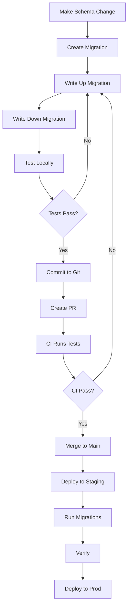

# Database Migration Guide

Complete guide for managing Neo4j schema evolution in this project.

## Related Documentation

- [Migration Runbook](MIGRATION_RUNBOOK.md) - Common migration tasks and troubleshooting
- [Schema Management](SCHEMA.md) - Schema directory overview
- [Database Seeding](SEEDING_GUIDE.md) - Load test data after migrations

## Table of Contents

- [Overview](#overview)
- [Quick Start](#quick-start)
- [Migration Workflow](#migration-workflow)
- [CLI Commands](#cli-commands)
- [Best Practices](#best-practices)
- [Troubleshooting](#troubleshooting)
- [CI/CD Integration](#cicd-integration)

## Overview

This project uses a custom migration system for Neo4j that provides:

- ✅ Version-controlled schema evolution
- ✅ Idempotent migrations
- ✅ Automatic execution in CI/CD
- ✅ Rollback capabilities
- ✅ Environment-specific migrations
- ✅ Checksum validation
- ✅ Comprehensive testing

### Architecture

```
src/db/
├── schema/              # Declarative schema definitions
│   ├── schema.cypher    # Node labels and relationships
│   ├── constraints.cypher
│   └── indexes.cypher
├── migrations/          # Version-controlled migrations
│   ├── common/          # Applied to all environments
│   ├── dev/             # Development only
│   └── prod/            # Production only
├── seeds/               # Test/dev data
└── scripts/             # Migration tooling
    ├── migrationRunner.ts
    ├── migrate.ts       # CLI tool
    └── types.ts
```

## Quick Start

### 1. Check Migration Status

```bash
npm run migrate:status
```

Output:
```
📊 Migration Status

Total migrations: 3
Applied: 1
Pending: 2

✅ Applied Migrations:
  ✓ 2025.10.15.000000 - init_migration_tracking.up.cypher
    Applied: 2025-10-15T10:30:00.000Z (145ms)

⏳ Pending Migrations:
  • 2025-10-15_120000_add_user_nodes.up.cypher
  • 2025-10-15_130000_add_relationships.up.cypher
```

### 2. Create a New Migration

```bash
npm run migrate:create add_technology_nodes
```

This generates:
- `src/db/migrations/common/2025-10-15_143022_add_technology_nodes.up.cypher`
- `src/db/migrations/common/2025-10-15_143022_add_technology_nodes.down.cypher`

### 3. Edit the Migration

```cypher
/*
 * Migration: Add Technology Nodes
 * Version: 2025.10.15.143022
 * Author: @yourname
 * Ticket: PROJ-123
 * 
 * Description:
 * Adds Technology node label with unique name constraint
 * to support tech stack tracking feature.
 *
 * Dependencies:
 * - None
 *
 * Rollback: See 2025-10-15_143022_add_technology_nodes.down.cypher
 */

CREATE CONSTRAINT technology_name_unique IF NOT EXISTS
FOR (t:Technology)
REQUIRE t.name IS UNIQUE;

CREATE INDEX technology_category IF NOT EXISTS
FOR (t:Technology)
ON (t.category);
```

### 4. Test the Migration (Dry Run)

```bash
npm run migrate:up -- --dry-run
```

### 5. Apply the Migration

```bash
npm run migrate:up
```

## Migration Workflow

### Development Workflow



### Multi-Step Migration Pattern

For breaking changes, use a three-phase approach:

**Phase 1: Add New Schema (Non-Breaking)**
```cypher
// 2025-10-15_120000_add_fullname_property.up.cypher
MATCH (u:User)
WHERE u.fullName IS NULL AND u.firstName IS NOT NULL
SET u.fullName = u.firstName + ' ' + u.lastName;
```

**Phase 2: Update Application Code**
- Deploy code that uses `fullName`
- Keep reading `firstName`/`lastName` as fallback
- Monitor for issues

**Phase 3: Remove Old Schema (After Validation)**
```cypher
// 2025-10-22_120000_remove_old_name_properties.up.cypher
MATCH (u:User)
REMOVE u.firstName, u.lastName;
```

## CLI Commands

### Status

Show current migration state:

```bash
npm run migrate:status
```

### Create

Generate new migration files:

```bash
npm run migrate:create <name>

# Example
npm run migrate:create add_user_roles
```

### Up (Apply)

Apply pending migrations:

```bash
# Dry run (preview)
npm run migrate:up -- --dry-run

# Apply migrations
npm run migrate:up

# Apply with verbose output
npm run migrate:up -- --verbose

# Force continue on errors (not recommended)
npm run migrate:up -- --force
```

### Down (Rollback)

Rollback migrations:

```bash
# Rollback last migration
npm run migrate:down

# Rollback to specific version
npm run migrate:down -- --to=2025.10.15.120000
```

### Validate

Validate migrations without applying:

```bash
npm run migrate:validate
```

## Best Practices

### ✅ DO

1. **Write Idempotent Migrations**
   ```cypher
   // Good
   CREATE CONSTRAINT user_email_unique IF NOT EXISTS
   FOR (u:User) REQUIRE u.email IS UNIQUE;
   
   // Bad
   CREATE CONSTRAINT user_email_unique
   FOR (u:User) REQUIRE u.email IS UNIQUE;
   ```

2. **Always Provide Rollback Scripts**
   Every `.up.cypher` must have a corresponding `.down.cypher`

3. **Test Before Production**
   ```bash
   # Test against copy of production data
   npm run migrate:up -- --dry-run
   ```

4. **Keep Migrations Small**
   One logical change per migration

5. **Document Thoroughly**
   Explain the "why" not just the "what"

6. **Use Transactions**
   Related changes should be atomic

7. **Version Everything**
   Commit migrations with code changes

### ❌ DON'T

1. **Modify Applied Migrations**
   Create a new migration instead

2. **Skip Rollback Scripts**
   Always provide a way back

3. **Make Destructive Changes**
   Use multi-step migrations

4. **Hardcode Values**
   Use parameters where appropriate

5. **Ignore Dependencies**
   Document migration order requirements

## Troubleshooting

### Migration Fails in Production

1. **Check status:**
   ```bash
   npm run migrate:status
   ```

2. **Review error in database:**
   ```cypher
   MATCH (m:Migration {status: 'FAILED'})
   RETURN m.filename, m.description, m.appliedAt
   ORDER BY m.appliedAt DESC
   LIMIT 1
   ```

3. **Options:**
   - Fix and re-run
   - Rollback: `npm run migrate:down`
   - Manual intervention (document in migration)

### Schema Drift Detected

When checksum validation fails:

```
❌ Migration 2025-10-15_120000_add_users.up.cypher has been modified!
   Expected: abc123...
   Got: def456...
```

**Resolution:**
1. Never modify applied migrations
2. Create a new corrective migration
3. Document the issue

### Long-Running Migration

For large data transformations:

```cypher
// Use APOC for batching
CALL apoc.periodic.iterate(
  "MATCH (n:OldLabel) RETURN n",
  "SET n:NewLabel REMOVE n:OldLabel",
  {batchSize: 1000, parallel: false}
) YIELD batches, total
RETURN batches, total;
```

### Migration Stuck

If migration appears hung:

1. Check Neo4j logs
2. Look for locks: `CALL dbms.listQueries()`
3. Consider timeout settings
4. May need maintenance window

## CI/CD Integration

### GitHub Actions Example

```yaml
name: Deploy

on:
  push:
    branches: [main]

jobs:
  deploy:
    runs-on: ubuntu-latest
    steps:
      - uses: actions/checkout@v3
      
      - name: Setup Node
        uses: actions/setup-node@v3
        with:
          node-version: '20'
      
      - name: Install dependencies
        run: npm ci
      
      - name: Run migrations (dry-run)
        env:
          NEO4J_URI: ${{ secrets.NEO4J_URI }}
          NEO4J_USERNAME: ${{ secrets.NEO4J_USERNAME }}
          NEO4J_PASSWORD: ${{ secrets.NEO4J_PASSWORD }}
        run: npm run migrate:up -- --dry-run
      
      - name: Run migrations
        env:
          NEO4J_URI: ${{ secrets.NEO4J_URI }}
          NEO4J_USERNAME: ${{ secrets.NEO4J_USERNAME }}
          NEO4J_PASSWORD: ${{ secrets.NEO4J_PASSWORD }}
        run: npm run migrate:up
      
      - name: Deploy application
        run: npm run deploy
```

### Pre-Deployment Checklist

- [ ] Migrations tested locally
- [ ] Rollback scripts verified
- [ ] Dry-run successful in staging
- [ ] Database backup created
- [ ] Monitoring alerts configured
- [ ] Rollback plan documented

## Testing Migrations

### Unit Tests

```bash
npm run test:migrations
```

### Integration Tests

```typescript
// tests/migrations/example.test.ts
import { describe, it, expect } from 'vitest'
import { MigrationRunner } from '@/db/scripts/migrationRunner'

describe('User Migrations', () => {
  it('should create user constraints', async () => {
    // Test implementation
  })
})
```

### Manual Testing

1. Create test database
2. Apply migrations
3. Verify schema
4. Test rollback
5. Verify clean state

## Environment-Specific Migrations

### Development

```
src/db/migrations/dev/
└── 2025-10-15_120000_seed_test_users.up.cypher
```

### Production

```
src/db/migrations/prod/
└── 2025-10-15_120000_optimize_indexes.up.cypher
```

Environment is detected from `NODE_ENV`:
- `development` → applies `common` + `dev`
- `production` → applies `common` + `prod`

## Monitoring

### Key Metrics

Track in your monitoring system:

- Migration execution time
- Migration success/failure rate
- Schema version per environment
- Time since last migration

### Alerts

Set up alerts for:

- Migration failures
- Execution time > threshold
- Schema drift detected
- Pending migrations in production

## Support

For issues or questions:

1. Check this documentation
2. Review migration logs
3. Check Neo4j logs
4. Contact the database team

## References

- [Neo4j Cypher Manual](https://neo4j.com/docs/cypher-manual/)
- [APOC Documentation](https://neo4j.com/labs/apoc/)
- [Migration Strategy Document](./MIGRATION_STRATEGY.md)
